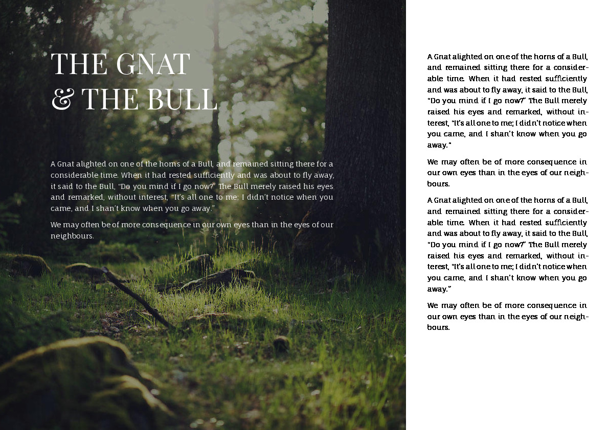

# pagemaker

Please note: This project is in no way affiliated with or related to the old Aldus PageMaker program from the 90s.

A structured document-to-page layout system for Typst that gives you complete control over element positioning while leveraging Typst's powerful typesetting engine and variable weight font support.

<p> </p>
The file examples/custom_styles_demo.org rendered without and with debug grid turned on. Note the custom font, the custom line spacing, the custom paragraph speration, thy hyphenation and the optional justification of the text. 


## Design Philosophy

Unlike traditional document systems that rely on automatic text flow and built-in spacing, pagemaker takes a fundamentally different approach:

- **Every page is explicitly described** - no automatic page breaks or content flow
- **Every element is explicitly positioned** - precise grid-based placement using A1-style coordinates
- **Gutter-free grid system** - clean grid divisions with no built-in spacing between cells
- **Element-level padding** - fine-grained spacing control through per-element padding properties
- **Professional typography** - leverages Typst's advanced typesetting with three bundled professional fonts (Inter, Crimson Pro, JetBrains Mono)

This approach is ideal for creating presentations, posters, reports, and any document where you need pixel-perfect control over layout and positioning.

## Features

### Migration Notice (Breaking Change)
PDF embedding now always uses automatic contain scaling (legacy `:FIT:` modes and the `:FULL_PAGE:` flag for `pdf` elements were removed). A previously documented optional `:SCALE:` multiplier is currently ignored and will emit a warning when specified.

New behavior (pdf elements only):
- The system computes a base auto-contain scale so the intrinsic PDF page fits entirely within the element's padded frame (respecting margins + element `:PADDING:`).
- User `:SCALE:` values (if present in older documents) are ignored for now (warning emitted). Future releases may reintroduce controlled fit modes.
- Result: PDFs never overflow their frame via scale; enlarge the `:AREA:` to show more context.

Migration:
- Remove any `:FIT:` / `:FULL_PAGE:` properties on `pdf` elements (ignored if still present).
- If you previously relied on `:FIT: contain` just delete it (behavior now default). If you relied on oversizing via `:FIT: fill` or manual big areas, you may enlarge the `:AREA:` instead; scale no longer exceeds containment.
- Image `figure` elements still support `:FIT:` (contain|cover|fill) unchanged.
- Legacy per-PDF alignment property (`pdf_align` / `:PDF_ALIGN:`) has been removed; use the standard `:ALIGN:` / `:VALIGN:` properties on `pdf` elements.

See the Vector PDF Embedding section below for details and examples.

### Core Functionality
- **Org-mode to Typst conversion (optional)**: Converts Org documents to Typst
- **Grid-based positioning**: Grid layout (e.g., 12x8) with A1-style areas
- **Element types**: Header, subheader, body text, image, PDF, rectangle, TOC
- **Z-order**: Element stacking control
- **Typography**: Fonts and basic theming

### Features
- **PDF embedding**: MuchPDF integration with sanitize/SVG/PNG fallback
- **Rectangles**: Colored overlays with alpha transparency
- **Images**: Fit modes (contain, cover, fill) and captions
- **Debug grid**: Optional grid lines and labels (columns 1..N, rows a..z)
- **Custom fonts**: Integrated font management system with Google Fonts integration
- **Text justification**: `:JUSTIFY:` for header/subheader/body (wraps Typst `par(justify: true)`)
- **Padding**: `:PADDING:` on text, images, SVG, and PDF (CSS-like TRBL shorthand in mm; per-side padding inherits and accumulates; if totals cancel to 0mm on all sides, generator still emits padded placement).
- **Alignment & flow**: `:ALIGN:` (left|center|right) for text/figure/svg/pdf/toc; `:VALIGN:` (top|middle|bottom) for text and pdf elements (note: `middle` maps to Typst `horizon`); `:FLOW:` (normal|bottom-up|center-out) — when `:VALIGN:` is not set for text, `:FLOW:` can imply vertical alignment (bottom-up -> bottom, center-out -> horizon).
- **Custom styles**: Per-document text styles via Org meta `#+STYLE_*` and per-element `:STYLE:` name. See Custom Styles section.

### Supported Elements

| Element Type | Description | Properties |
|-------------|-------------|------------|
| `header` | Main headings | Font: Inter Bold, 24pt |
| `subheader` | Section headings | Font: Inter SemiBold, 18pt |  
| `body` | Regular text | Font: Inter Regular |
| `figure` | Images with optional captions | Supports fit modes, captions |
| `pdf` | Vector PDF embedding | Page selection, scaling |
| `svg` | SVG image embedding | Fit: contain; path via `:SVG:` |
| `rectangle` | Colored overlays | Custom colors, alpha transparency |
| `toc` | Table of contents | Auto-lists slide titles (• 1. Title); supports :AREA:, :PADDING:, :ALIGN: |

## Quick Start

### Installation
```bash
# Install from PyPI
pip install typst-pagemaker

# Verify installation
pagemaker --help
typst --version  # Ensure Typst is also installed
```

### Requirements

**Essential Dependencies:**
- **Typst** - The core typesetting engine. Install from [typst.app](https://typst.app/docs/tutorial/installation/)
- **MuPDF tools (mutool)** - Essential for PDF processing, SVG/PNG fallback generation, and `--sanitize-pdfs` functionality

**Optional Dependencies:**
- **qpdf** - Enhanced PDF repair and normalization  
- **Ghostscript (gs)** - Alternative PDF processing and PNG rendering

Install platform-specific dependencies:
```bash
# macOS (via Homebrew)
brew install typst mupdf qpdf ghostscript

# Ubuntu/Debian
sudo apt update && sudo apt install typst-cli mupdf-tools qpdf ghostscript

# Arch Linux
sudo pacman -S typst mupdf-tools qpdf ghostscript

# Windows (via winget or chocolatey)
winget install --id Typst.Typst
# For MuPDF, download from: https://mupdf.com/releases/index.html
```

### Development Installation
```bash
# Clone the repository for development
git clone https://github.com/sanderboer/typst-pagemaker.git
cd typst-pagemaker

# Install in editable mode
pip install -e .
pagemaker --help
```

### Basic Usage (New Multi-Command CLI)

#### Watch Mode
Continuously rebuild Typst (and optionally PDF) when the source Org file changes.
```
# Rebuild typst on change
pagemaker watch examples/sample.org --export-dir export

# Build PDF on each change, keep intermediate .typ
pagemaker watch examples/sample.org --pdf --no-clean --export-dir export

# Single build (no loop) - useful for tests
pagemaker watch examples/sample.org --once --export-dir export
```
Options:
- `--interval <seconds>`: Polling interval (default 1.0)
- `--pdf`: Also compile PDF each rebuild
- `--pdf-output <file>`: Custom PDF filename
- `--typst-bin <path>`: Path to `typst` binary
- `--no-clean`: Keep the intermediate `.typ` after PDF build
- `--update-html <path>`: Update existing HTML file's page count placeholder
- `--once`: Perform exactly one build then exit
- `--sanitize-pdfs`: Attempt to sanitize PDFs; if Typst compile still fails, auto-fallback to SVG or PNG for the requested page

```bash
# Build Typst from Org (org -> typst)
pagemaker build examples/sample.org -o deck.typ

# Build and produce PDF (cleans .typ by default)
pagemaker pdf examples/sample.org --pdf-output deck.pdf

# Build with PDF sanitize + fallback (qpdf/mutool/gs optional)
pagemaker pdf examples/sample.org --sanitize-pdfs --pdf-output deck.pdf

# Emit IR JSON to stdout
pagemaker ir examples/sample.org > ir.json

# Validate IR (non-zero exit on error)
pagemaker validate examples/sample.org
```


Manual Typst compile (if you only produced .typ):
```bash
typst compile --root . --font-path assets/fonts --font-path assets/fonts/static export/deck.typ export/deck.pdf
```

Or use the Makefile targets:
```bash
make debug-overlay  # Build debug example
```

#### Asset Path Semantics
When exporting into an `export/` directory, any relative asset references in the Org file like:
```
[[file:assets/diagram.png]]
:PDF: assets/spec.pdf
:SVG: assets/graphics/logo.svg
```
are automatically rewritten so the generated `deck.typ` can reside in `export/` while still finding the assets in the project root. You can also use absolute paths if preferred.

### Example Org File

Dynamic helpers available in text:
- `#page_no` / `#page_total` for page counters (no parentheses; Typst context-based).
- Dates: `#date_iso` (YYYY-MM-DD), `#date_yy_mm_dd` (YY.MM.DD), `#date_dd_mm_yy` (DD.MM.YY)
- To lock dates for reproducible builds, set `#+DATE_OVERRIDE: YYYY-MM-DD` (or `#+DATE:`) in the Org meta header.

TOC element:
- Add a `toc` element to list slide titles automatically.
```org
** Table of Contents
:PROPERTIES:
:TYPE: toc
:AREA: A1,L8
:PADDING: 4,6
:END:
```


Text: use `:JUSTIFY:` to enable full justification and `:PADDING:` to inset content in millimeters.
(place this snippet in the examples folder in order for pagemaker to find the fonts and images that are already bundled in the examples/asset folder)

<div style="display: flex; justify-content: space-between; align-items: center;"></div>

```org
#+TITLE: My Presentation
#+PAGESIZE: A4
#+ORIENTATION: landscape
#+GRID: 12x8
#+GRID_DEBUG: false
#+STYLE_WHITE_BODY: font: Playfair Display,  color: #ffffff, size: 16pt, spacing: 20pt


* Introduction Slide
:PROPERTIES:
:ID: intro_slide
:END:

** Main Title
:PROPERTIES:
:TYPE: header
:AREA: b1,c4
:PADDING: 8,8
:JUSTIFY: 
:Z: 10
:END:
Welcome to pagemaker

** Background Rectangle
:PROPERTIES:
:TYPE: rectangle
:AREA: A1,L4
:COLOR: #3498db
:ALPHA: 0.2
:Z: -1
:END:

** Demo Image
:PROPERTIES:
:TYPE: figure
:AREA: A5, H12
:PADDING: 0,0,0,0
:FIT: cover
:Z: -1
:END:
[[file:assets/test-images/landscapes/landscape-1.jpg]]

** poem
:PROPERTIES:
:TYPE: body
:STYLE: white_body
:AREA: C7,D10
:valign: top
:END:

I am but a leaf

Clinging to the tree of life

In the world’s garden.

** poem
:PROPERTIES:
:TYPE: subheader
:STYLE: white_body
:AREA: E7,F10
:align: right
:valign: middle
:END:
Last night I saw you,

A dream rose and I your stem

Showing you the sun.

```

## Directory Structure

```
typst-pagemaker/
├── src/                    # Source code
│   ├── pagemaker/          # Package (parser, generator, CLI)
├── bin/                    # Build tools and scripts
│   ├── Makefile            # Build automation
│   └── debug_test_fonts.sh
├── examples/               # Example Org files and outputs
│   ├── assets/             # Fonts and test resources
│   │   ├── fonts/            # Downloaded fonts
│   │   ├── test-images/      # Sample images for testing
│   │   └── test-pdfs/        # Sample PDFs for testing
├── tests/          # Test suite
│   ├── unit/          # Unit tests
│   ├── integration/   # Integration tests
│   └── fixtures/      # Test data
└── docs/              # Documentation
```

## Quick Reference

### Common Element Properties
| Property | Values | Description |
|----------|--------|-------------|
| `:TYPE:` | `header`, `subheader`, `body`, `figure`, `pdf`, `svg`, `rectangle`, `toc` | Element type |
| `:AREA:` | `A1`, `B3,F5` | Grid position (A1 notation) |
| `:Z:` | `10`, `100` | Stacking order (higher on top) |
| `:PADDING:` | `4`, `2,4`, `2,4,6,8` | Margin in mm (CSS TRBL) |
| `:ALIGN:` | `left`, `center`, `right` | Horizontal alignment |
| `:VALIGN:` | `top`, `middle`, `bottom` | Vertical alignment (text + pdf elements) |
| `:JUSTIFY:` | (bare) or `true`/`false` | Full text justification |
| `:IGNORE:` | `true`, `false` | When `true`: drop this page (level 1) or this section and its subtree (level ≥2). If `:TYPE:` is missing or `none`, only the element is omitted; children still parse. |

### Page Setup Headers
| Header | Example | Description |
|--------|---------|-------------|
| `#+PAGESIZE:` | `A4`, `A3`, `A1` | Page size |
| `#+ORIENTATION:` | `landscape`, `portrait` | Page orientation |
| `#+GRID:` | `12x8`, `16x9` | Grid dimensions |
| `#+MARGINS:` | `10,15,10,15` | Margins in mm (TRBL) |
| `#+GRID_DEBUG:` | `true`, `false` | Show debug grid |

### Element Types Quick Syntax
```org
** Header Text
:PROPERTIES:
:TYPE: header
:AREA: A1,F2
:END:

** Image
:PROPERTIES:
:TYPE: figure
:AREA: G1,L4
:FIT: contain
:END:
[[file:path/to/image.jpg]]

** PDF Page
:PROPERTIES:
:TYPE: pdf
:PDF: path/to/doc.pdf
:PAGE: 2
:AREA: A5,F8
:END:

** Colored Rectangle
:PROPERTIES:
:TYPE: rectangle
:AREA: B2,K7
:COLOR: #3498db
:ALPHA: 0.3
:END:
```

## Configuration

### Page Setup
- **PAGESIZE**: A4, A3, A2, A1, A5
- **ORIENTATION**: landscape, portrait
- **GRID**: Custom grid dimensions (e.g., 12x8, 16x9)
- **MARGINS**: Absolute mm in CSS TRBL order (top,right,bottom,left)
- **GRID_DEBUG**: Show/hide debug grid lines
Notes:
- Typst page size is set once at the document level from the first rendered page’s `PAGESIZE` and `ORIENTATION`. Per-page overrides are ignored during Typst generation; the validator warns if pages disagree.
- `:AREA:` always addresses the total grid (including margin tracks); there is no `:COORDS:` directive.

### Element Properties

#### Ignore Semantics
- `:IGNORE: true` on a page (level 1) removes the entire page from the IR; following sections under that page are also ignored until the next page.
- `:IGNORE: true` on a section (level ≥2) removes that section and its entire subtree.
- If `:TYPE:` is omitted or explicitly set to `none`, the element itself is omitted from the IR but its children are still parsed/emitted if they declare a valid `:TYPE:`.

#### Validation Rules
The `validate` subcommand parses Org -> IR, then enforces structural rules.
Errors (fail the build):
- Duplicate page IDs
- Duplicate element IDs
- Rectangle alpha outside 0.0–1.0
- Area issues: non-positive dimensions or exceeding page grid bounds (when grid + area fully specified)

Warnings (reported but do not fail):
- Unknown element types (fallback treatment may change later)
- Missing figure or PDF asset file (relative path that does not exist when validating)

To escalate missing asset warnings into errors (e.g., for CI pipelines), use:
```
pagemaker validate --strict-assets examples/sample.org
```
This makes missing figure/pdf assets fail validation (non-zero exit code).

Example:
```
pagemaker validate examples/sample.org
```
Exit code 0 means no errors (warnings may still appear).
- **TYPE**: Element type (header, subheader, body, figure, pdf, rectangle)
- **AREA**: A1-style coordinates are preferred (e.g., single cell "B3" or range "A1,C2"). Rows are letters (A=1), columns are numbers. Legacy numeric "x,y,w,h" is still supported.
- **Z**: Stacking order (higher numbers appear on top)
- **COLOR**: Hex color for rectangles (#RRGGBB)
- **ALPHA**: Transparency (0.0 = transparent, 1.0 = opaque)
- **FIT**: Image fitting (contain, cover, fill)
- **PADDING**: Optional mm padding around content. CSS-like shorthand: `PADDING: t` | `t,r` | `t,r,b` | `t,r,b,l`. Applies to text (header/subheader/body), figures, SVG, and PDF.
- **JUSTIFY**: Optional boolean for text elements. `:JUSTIFY:` (bare) or `:JUSTIFY: true` enables full justification; `false` disables. Maps to Typst `par(justify: true)` wrapping.
- **ALIGN**: Horizontal alignment within the element frame. Values: `left`, `center`, `right`. Applies to text (`header`, `subheader`, `body`) and media (`figure`, `svg`, `pdf`, `toc`).
- **VALIGN**: Vertical alignment within the element frame. Values: `top`, `middle`, `bottom`. Applies to text elements. Note: `middle` maps to Typst `horizon` (Typst’s vertical-center token).
- **FLOW**: Layout hint for text elements. Values: `normal`, `bottom-up`, `center-out`. Emitted as a comment for visibility, and when `:VALIGN:` is not set it can imply vertical alignment: `bottom-up` -> `bottom`, `center-out` -> `horizon`. Otherwise, explicit `:VALIGN:` wins.

## Tooling

**Essential external tools:**
- `typst`: Required for all document compilation
- `mutool` (MuPDF): Essential for PDF processing, SVG/PNG fallback generation, and full `--sanitize-pdfs` functionality

**Optional external tools** that enhance PDF handling with `--sanitize-pdfs`:
- `qpdf`: Repairs and normalizes PDF structure (stream recompress, object streams)
- `gs` (Ghostscript): Alternate PDF distillation and PNG fallback rendering

The CLI automatically detects these tools. If unavailable, related stages are skipped, but missing essential tools will limit core functionality.

## Advanced Usage

See the in-depth guide: docs/master_styles.md (styles, paragraph options, master pages, margins/grid, and padding semantics including zero-sum).

### Custom Styles
- Declare styles in document meta using `#+STYLE_<NAME>:` where `<NAME>` is case-insensitive. Built-ins: `HEADER`, `SUBHEADER`, `BODY`.
- Supported keys (case-insensitive) with aliases:
  - font | font-family
  - weight | font-weight (numeric or names like bold, semibold)
  - size | font-size (Typst units like `pt`, `em`)
  - color | colour | fill (supports `#hex`, `rgb(...)`, `hsl(...)`, or named)
- Use a style on an element by setting `:STYLE:` to the style name (e.g., `hero`). If omitted, the element’s type is used as the style key (`header`, `subheader`, `body`).
- Commas inside parentheses are handled correctly (e.g., `rgb(50%,50%,50%)`).

Example:
```org
#+STYLE_HEADER: font: Inter, weight: 900, size: 30pt, color: #ff00aa
#+STYLE_BODY: font: Inter, color: rgb(50%,50%,50%)
#+STYLE_HERO: font: Inter, weight: bold, size: 36pt, color: #123456

* Title
:PROPERTIES:
:TYPE: header
:AREA: 1,1,6,1
:END:
My Header

** Big Title
:PROPERTIES:
:TYPE: body
:STYLE: hero
:AREA: 1,2,12,2
:END:
Big Title
```
See `examples/custom_styles_demo.org` for a complete, runnable example.

#### Paragraph Options
- Style declarations may also include paragraph settings applied via Typst `par(...)`:
  - `leading`: Line leading (Typst length, e.g., `1.4em`, `14pt`).
  - `spacing`: Space between paragraphs (length).
  - `first-line-indent` (or `first_line_indent`): Indent the first line (length).
  - `hanging-indent` (or `hanging_indent`): Hanging indent for subsequent lines (length).
  - `linebreaks`: Typst line-breaking mode token (e.g., `auto`, `loose`, `strict`).
  - `justify`: Boolean or token; when set, maps to `justify: true|false`.
- Element-level `:JUSTIFY:` always overrides the style’s `justify` value.

Paragraphs are split by:
- Blank lines
- Lines that are exactly `---` or `:::`

If a text block splits into multiple paragraphs, each paragraph is wrapped with `par(...)`. Paragraphs are concatenated without extra blank lines; the visible gap is controlled by the style’s `spacing` value. If `spacing` is omitted, the next paragraph appears as a line break with minimal separation. When there is a single paragraph and no paragraph options or justification are set, the text is emitted without a `par(...)` wrapper for backward compatibility.

Example (Org):
```org
#+STYLE_BODY: font: Inter, leading: 1.4em, spacing: 1em, first-line-indent: 2em, hanging-indent: 1em, linebreaks: loose, justify: false

** Styled Body
:PROPERTIES:
:TYPE: body
:AREA: A1,L8
:JUSTIFY: true   # element-level override
:END:
First paragraph line one.

---
Second paragraph, now with the style’s paragraph options and justify enabled.
```

### Custom Fonts
The package includes professional bundled fonts as a reliable default, with support for rich project-specific font libraries.

**Font Resolution Order:**
1. **Project fonts**: `assets/fonts/` (custom library checked first)  
2. **Bundled fonts**: Package-included minimal defaults (Inter, Crimson Pro, JetBrains Mono)
3. **System fonts**: Typst automatically discovers installed system fonts (final fallback)

**Bundled Fonts (Always Available):**
- **Inter**: Modern sans-serif optimized for screens and interfaces
- **Crimson Pro**: Professional serif for body text and academic documents  
- **JetBrains Mono**: Code-friendly monospace with excellent readability

**Project Font Library:**
```bash
# Add custom fonts to your project
mkdir -p assets/fonts/FontFamily
cp path/to/FontFamily-*.ttf assets/fonts/FontFamily/

# Fonts are automatically discovered and available in your documents
```

**Font Management CLI:**
```bash
# List all available fonts
pagemaker fonts list-all

# Show bundled fonts only
pagemaker fonts list-bundled --details

# Show project fonts only  
pagemaker fonts list-project --details

# Validate specific font availability
pagemaker fonts validate "Inter"
pagemaker fonts validate "Your Custom Font"
```

**Using Custom Fonts:**
```org
# Reference any available font in your documents
#+CUSTOM_STYLE: #set text(font: "Your Custom Font", size: 12pt)

* Heading with Custom Typography
#set text(font: "Playfair Display", weight: "bold", size: 18pt)

This heading uses a custom display font for elegant typography.

#set text(font: "Inter")
This paragraph switches back to the reliable bundled Inter font.
```

**Font Discovery:**
The system automatically includes all font paths in the correct precedence order. Project fonts in `assets/fonts/` take priority over bundled fonts, ensuring reliable defaults with easy customization.

## Font Management System

The pagemaker CLI includes a comprehensive font management system to help discover, install, analyze, and preview fonts in your projects.

### Font Discovery and Listing

List all fonts available to your project:
```bash
# Show all available fonts (project + bundled + system)
pagemaker fonts list-all

# Show only bundled fonts with details
pagemaker fonts list-bundled --details

# Show only project fonts with details  
pagemaker fonts list-project --details

# Validate specific font availability
pagemaker fonts validate "Inter"
pagemaker fonts validate "Playfair Display"
```

### Google Fonts Integration

Search and install fonts directly from Google Fonts:
```bash
# Search for fonts by name
pagemaker fonts search "Playfair"
pagemaker fonts search "mono" --limit 10

# Install fonts to your project
pagemaker fonts install "Playfair Display"
pagemaker fonts install "JetBrains Mono" --variants regular,700,italic

# Clear font installation cache
pagemaker fonts cache-clear
```

**Installation Details:**
- Fonts are downloaded from Google Fonts API with offline fallback for popular fonts
- Installed to `assets/fonts/FontFamily/` directory structure
- Supports variant selection (regular, 700, italic, etc.)
- Automatically creates proper directory structure

### Font Usage Analysis

Analyze your documents to find font references and check availability:
```bash
# Analyze font usage in a document
pagemaker fonts analyze examples/sample.org

# Analyze with installation suggestions for missing fonts
pagemaker fonts analyze examples/font_management_demo.org
```

**Analysis Features:**
- Detects fonts referenced in `#+CUSTOM_STYLE` and `#set text(font: "Name")` patterns
- Cross-references with available font inventory from all sources
- Provides installation suggestions for missing fonts
- Shows font availability status (✓ Available, ✗ Missing)

### Font Specimen Generation

Generate font showcase documents to preview and compare fonts:
```bash
# Generate comprehensive font specimen
pagemaker fonts specimen my-fonts.org

# Generate simple comparison format
pagemaker fonts specimen fonts-comparison.org --format comparison

# Generate simple list format  
pagemaker fonts specimen fonts-list.org --format simple

# Auto-build PDF after generating specimen
pagemaker fonts specimen my-fonts.org --build-pdf
```

**Specimen Formats:**
- **showcase** (default): Detailed specimens with multiple text samples and sizes
- **comparison**: Side-by-side comparison with consistent sample text
- **simple**: Minimal list format with basic font information

### Build-Time Font Validation

Integrate font validation into your build process:
```bash
# Build with font validation (warnings only)
pagemaker build examples/sample.org --validate-fonts

# Build with strict font validation (fails on missing fonts)  
pagemaker pdf examples/sample.org --strict-fonts --pdf-output output.pdf

# Watch mode with font validation
pagemaker watch examples/sample.org --validate-fonts --pdf
```

**Validation Features:**
- Scans document for font references during build
- Reports missing fonts with helpful error messages
- Suggests installation commands for missing Google Fonts
- `--validate-fonts`: Shows warnings but continues build
- `--strict-fonts`: Fails build on missing fonts (useful for CI/CD)

### Performance Optimization

The font system includes caching for improved performance:
- **Font discovery caching**: Results cached for 5 minutes to speed up repeated operations
- **Google Fonts API caching**: Downloaded font lists cached locally
- **Cache invalidation**: Automatically detects font directory changes
- **Graceful fallback**: Continues operation if caching fails

### Font Management Examples

**Complete workflow for adding a new font:**
```bash
# 1. Search for desired font
pagemaker fonts search "Crimson"

# 2. Install the font
pagemaker fonts install "Crimson Pro"

# 3. Verify installation
pagemaker fonts validate "Crimson Pro"

# 4. Generate specimen to preview
pagemaker fonts specimen fonts-preview.org --format showcase

# 5. Use in your document
echo '#+CUSTOM_STYLE: #set text(font: "Crimson Pro", size: 12pt)' >> my-doc.org

# 6. Build with font validation
pagemaker pdf my-doc.org --validate-fonts --pdf-output my-doc.pdf
```

**Analyzing and fixing font issues:**
```bash
# Analyze document for font problems
pagemaker fonts analyze problematic-doc.org

# Output might show:
# ✗ Missing: "Custom Font" - try: pagemaker fonts install "Custom Font"
# ✓ Available: "Inter"

# Install missing fonts as suggested
pagemaker fonts install "Custom Font"

# Rebuild with validation
pagemaker pdf problematic-doc.org --strict-fonts --pdf-output fixed-doc.pdf
```

### Colored Rectangles
Create transparent overlays and design elements:
```org
** Background Accent
:PROPERTIES:
:TYPE: rectangle
:AREA: B2,I6
:COLOR: #FF6B6B
:ALPHA: 0.3
:Z: 10
:END:
```

### Vector PDF Embedding
Include high-quality PDF pages with fallback support:
```org
** Technical Diagram
:PROPERTIES:
:TYPE: pdf
:PDF: assets/technical-drawing.pdf
:PAGE: 2
# (Deprecated) :SCALE: 1.2  -> ignored; auto-contain applied
:AREA: D2,I5
:Z: 50
:END:
```
Notes:
- For problematic PDFs with MuchPDF, run the CLI with `--sanitize-pdfs`.
- If sanitization still fails, the first requested page is auto-converted to SVG (preferred) or PNG and embedded as an image.
- Fallback assets are written under `export_dir/assets/pdf-fallbacks/` and linked in the generated Typst.

PDF scaling semantics (automatic contain + multiplier):
- Intrinsic PDF size is parsed (MediaBox) to obtain its natural width/height in mm.
- The usable element frame is the declared `:AREA:` cell span minus element `:PADDING:` (and respects page `#+MARGINS:` when present).
- Applied scale: `base_scale = min(frame_w_mm / pdf_w_mm, frame_h_mm / pdf_h_mm)` (falls back to 1.0 when intrinsic probing fails).
- Any legacy `:SCALE:` property (from earlier docs) is currently ignored with a warning; only containment is applied.
- Element `:PADDING:` reduces the frame before base scale calculation (shrinking resulting size).

Legacy validation errors related to `:SCALE:` are currently dormant because `:SCALE:` is ignored; future fit/scale options may restore stricter validation.

Migration from older versions:
- Remove any `:FIT:` or `:FULL_PAGE:` on pdf elements (ignored if present).
- If you depended on `:FIT: contain`, just delete it (now default implicit behavior).
- If you previously used `:FIT: fill` to overshoot, enlarge the `:AREA:` instead; scale is capped at containment.
- To simulate a full-page background, span the entire (including margin tracks) grid with `:AREA:` and keep default scale.

Planned (optional) debug: A future `:PDF_DEBUG_SCALE:` flag may emit computed `pdf_w_mm`, `pdf_h_mm`, `frame_w_mm`, `frame_h_mm`, `base_scale` as Typst comments for troubleshooting (user scale currently unused).

### SVG Embedding
Embed SVG graphics directly:
```org
** Vector Graphic
:PROPERTIES:
:TYPE: svg
:SVG: assets/test-svgs/test-plan-p11.svg
:AREA: C2,J6
:END:
```
- Paths are treated like other assets and adjusted relative to the export directory.
- Fit defaults to contain within the target area.

### Margins
Define outer margins in millimeters that expand the total grid while keeping your content coordinates stable. Format: `top,right,bottom,left` (CSS TRBL order).
```org
#+GRID: 12x8
#+MARGINS: 10,15,10,15

* Slide
:PROPERTIES:
:ID: s1
:END:

** Full-bleed background (uses margin tracks)
:PROPERTIES:
:TYPE: rectangle
:AREA: 1,1,14,10
:COLOR: #3498db
:ALPHA: 0.1
:END:

** Content inside margins
:PROPERTIES:
:TYPE: body
:AREA: A1,L8
:END:
The content grid remains 12x8, but the total grid has one margin track on each side. Content coordinates map to total with a +1,+1 offset when margins are present.
```
Notes:
- `MARGINS` values are absolute sizes in mm.
- `:AREA:` always addresses the total grid (including margin tracks). The content grid remains your declared `GRID` inside the margins; when margins are present, content coordinates map to total with a +1,+1 offset.
- With `#+GRID_DEBUG: true`, the overlay shows the total grid (including margin tracks). Labels cover all tracks: first column is `1`, first row is `A`.

### Master Pages
See examples/master_pages_demo.org for a runnable master page setup.


Define reusable element sets as master pages that are not directly rendered. Apply them per slide with `:MASTER:` or globally with `#+DEFAULT_MASTER:`.
```org
#+DEFAULT_MASTER: Base

* Base Master (not rendered)
:PROPERTIES:
:MASTER_DEF: Base
:END:

** Header Bar
:PROPERTIES:
:TYPE: rectangle
:AREA: A1,A12
:COLOR: #000000
:ALPHA: 0.08
:END:

** Footer Text
:PROPERTIES:
:TYPE: body
:AREA: H11,H12
:END:
Page #page_no / #page_total — #date_dd_mm_yy

* Slide One (inherits Base)
:PROPERTIES:
:ID: s1
:END:

** Title
:PROPERTIES:
:TYPE: header
:AREA: B2,C11
:END:
Welcome with Master
```
Notes:
- Pages that define `:MASTER_DEF:` are used as master definitions and are skipped at render time.
- Slides can reference a master via per-page `:MASTER:` or inherit from `#+DEFAULT_MASTER:`.
- Master elements are combined with slide elements and z-ordered together.

## A1 AREA Notation

- Rows are letters A..Z, then AA, AB, etc. (case-insensitive). A maps to row 1.
- Columns are numbers starting at 1.
- Single cell: "B3" -> [x=3, y=2, w=1, h=1].
- Range: "A1,C2" -> inclusive rectangle normalized to top-left/bottom-right yielding [x=1, y=1, w=2, h=3].
- Reverse ranges like "C2,A1" are normalized the same as "A1,C2".
- Legacy format "x,y,w,h" remains supported for backward compatibility.
- Debug grid labels: columns show 1..N at top; rows show a..z at left (rows > 26 currently fall back to numeric display).

## Editor Integration (Emacs)

pagemaker ships a CLI, and an optional Emacs minor mode (org-pagemaker) to drive the CLI from Org buffers. This section shows how to install and use it.

### Requirements
- Emacs 27 or newer recommended
- Optional: hydra package (for the in-buffer command menu)
- pagemaker CLI available on PATH (pip install typst-pagemaker)

### Install via straight.el
```elisp
;; Stable: pin to a released tag (recommended)
(use-package org-pagemaker
  :straight (org-pagemaker
             :type git
             :host github
             :repo "sanderboer/org-pagemaker"
             :tag "v0.1.2"         ;; pin to a release tag (if available)
             :files ("lisp/*.el"))
  :hook (org-mode . org-pagemaker-mode))


;; (use-package org-pagemaker
;;   :straight (org-pagemaker :type git :host github :repo "sanderboer/org-pagemaker" :files ("lisp/*.el"))
;;   :hook (org-mode . org-pagemaker-mode))
```

Notes:
- The Emacs package is developed in a separate repo; this project’s .gitignore ignores any nested pagemaker-el/ checkout under the root.
- Ensure the pagemaker executable resolves in Emacs (M-: (executable-find "pagemaker")). If needed, adjust exec-path or your shell init for GUI Emacs.

### Keybindings (org-pagemaker-mode)
- C-c p h: Show the org-pagemaker Hydra (if hydra is installed)
- C-c p b: Build Typst (.typ)
- C-c p p: Build PDF
- C-c p w: Watch and rebuild on save
- C-c p v: Validate IR
- C-c p s: Build with PDF sanitize/fallback
- C-c p o: Open last output (PDF/Typst)
- C-c p i: Insert example/template

The Hydra is an optional convenience. If hydra is not present, C-c p h displays a helpful message; all other keybindings continue to work.

### Quick check
1) Open any of the example .org files in this repo
2) Enable the mode: M-x org-pagemaker-mode
3) Run C-c p b to generate a .typ into export/ (or use C-c p p for a PDF if Typst is installed)

### Pinning and upgrades
- Prefer pinning to a stable tag (e.g., :tag "v0.1.2" when available).
- To update: bump the :tag or track main and run straight-pull followed by straight-rebuild.

## Development

### Running Tests
```bash
make test
# or
python -m unittest discover tests -v
```

- The suite includes an optional PDF compile test that runs `pagemaker pdf` end-to-end and compiles via Typst. It automatically skips if `typst` or the `@preview/muchpdf` package are unavailable on your system.

### Code Style & Pre-commit

This project uses pre-commit with Ruff for formatting and linting.

Setup:
```bash
pip install pre-commit
pre-commit install
```

Run hooks on the entire repo:
```bash
pre-commit run --all-files
```

Tools:
- Formatter: Ruff formatter (`ruff-format`)
- Linter: Ruff check with autofix

Current temporary linter ignores (to keep commits unblocked):
- E501 (line length) — many long Typst/doc lines
- B028, B007 — non-critical warnings
- UP006, UP035 — typing modernization postponed
- F841 — temporary allowance for unused variables

Run Ruff manually:
```bash
ruff format .
ruff check . --fix
```

We plan to remove the temporary ignores as the codebase is modernized.

### Contributing
1. Fork the repository at https://github.com/sanderboer/typst-pagemaker
2. Create a feature branch
3. Make your changes
4. Add tests for new functionality
5. Submit a pull request

## License

MIT License - see [LICENSE](https://github.com/sanderboer/typst-pagemaker/blob/main/LICENSE) file for details.

## Author

Created for building Typst-based slide decks from Org-mode.

---

*For more detailed documentation, examples, and advanced usage patterns, see the `docs/` directory and `examples/` folder.*
