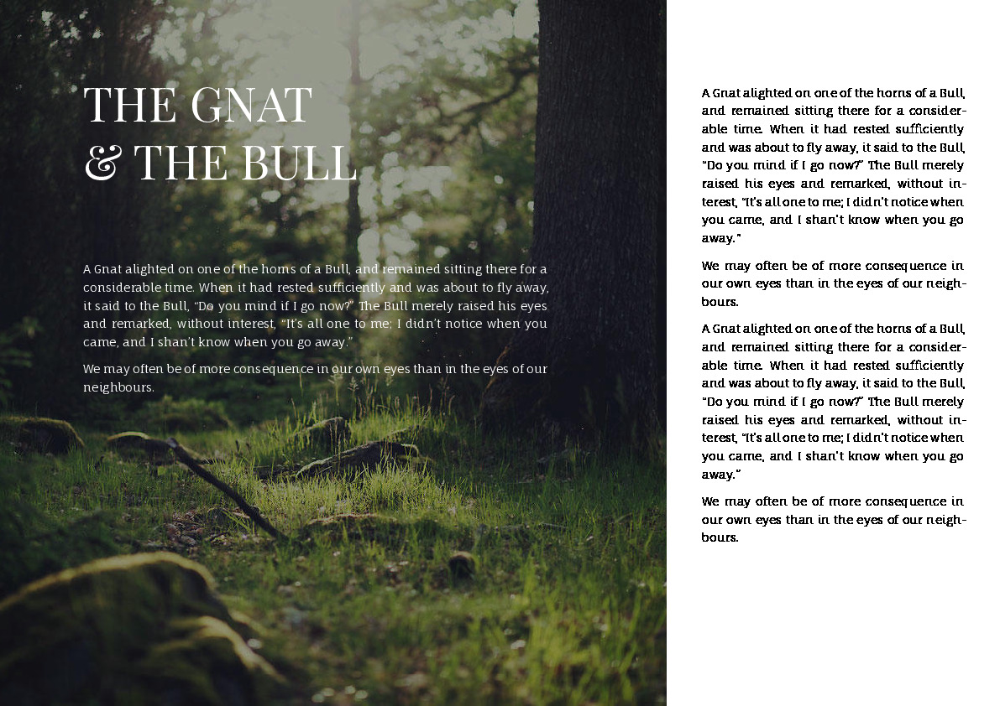

# pagemaker

Please note: This project is in no way affiliated with or related to the old Aldus PageMaker program from the 90s.

A dual-export document layout system that transforms org-mode files into professional PDFs and web-optimized HTML.

**PDF Export:** Precise grid-based positioning with Typst's powerful typesetting engine for print-ready documents.

**HTML Export:** Grid-faithful web rendering with CSS Grid layouts that mirror PDF positioning, optimized for web viewing.

<p> </p>
The file examples/custom_styles_demo.org rendered without and with debug grid turned on. Note the custom font, the custom line spacing, the custom paragraph speration, thy hyphenation and the optional justification of the text. 


## Design Philosophy

**PDF Mode (Precision Layout):**

Unlike traditional document systems that rely on automatic text flow and built-in spacing, pagemaker takes a fundamentally different approach:

- **Every page is explicitly described** - no automatic page breaks or content flow
- **Every element is explicitly positioned** - precise grid-based placement using A1-style coordinates
- **Gutter-free grid system** - clean grid divisions with no built-in spacing between cells
- **Element-level padding** - fine-grained spacing control through per-element padding properties
- **Professional typography** - leverages Typst's advanced typesetting with three bundled professional fonts (Inter, Crimson Pro, JetBrains Mono)

This approach is ideal for creating presentations, posters, reports, and any document where you need pixel-perfect control over layout and positioning.

**HTML Export (Web Viewing):**

For web-focused output, HTML export provides maximum PDF fidelity in the browser:

- **Grid-faithful positioning** - CSS Grid layouts mirror PDF grid coordinates exactly
- **Per-page sections** - full-viewport pages with individual grid configurations
- **Web font support** - same fonts as PDF using WOFF2 web fonts
- **Customizable styling** - separate CSS/JS files for easy theming
- **Rich media support** - images, SVGs, PDFs, tables, lists

HTML export is ideal for creating web presentations, documentation, and any content that needs to match PDF layout while being viewable in browsers.

## Features

### Breaking Changes & Migration

**Media Embedding Updates:**
All media types (images, PDFs, SVGs) now support unified fit modes with consistent behavior.

**Current behavior (all media types):**
- All fit modes supported: `contain`, `cover`, `stretch`
- Cover mode works with alignment-based cropping for all media types
- Alignment properties (`:ALIGN:`, `:VALIGN:`) control positioning and visible region
- Intrinsic sizing automatically detected for all media types

**Migration steps:**
- Legacy `:PDF:` and `:SVG:` properties are deprecated—use `[[file:...]]` links (recommended) or `:SRC:` property
- All media types support native org-mode `[[file:...]]` link syntax
- Legacy `:PDF_ALIGN:` property was removed—use standard `:ALIGN:` / `:VALIGN:`

See the [Media Embedding](#media-embedding-images-pdfs-svgs) section for comprehensive documentation.

### Core Functionality

**Two Export Formats:**
- **PDF Export**: Org-mode to Typst to PDF conversion with precise grid-based positioning
- **HTML Export**: Org-mode to HTML conversion with CSS Grid layouts mirroring PDF positioning

**Common Features:**
- **Grid-based positioning**: Grid layout (e.g., 12x8) with A1-style areas, consistent across PDF and HTML
- **Element types**: Header, subheader, body text, image, PDF, SVG, rectangle, TOC
- **Z-order**: Element stacking control
- **Typography**: Professional fonts and theming
- **Watch mode**: Auto-rebuild on file/asset changes for both PDF and HTML

**When to Use Each Format:**

| Use Case | PDF Export | HTML Export |
|----------|----------|------------|
| Print documents | ✅ Best choice | ❌ Not suitable |
| Presentations (offline) | ✅ Precise control | ⚠️ Web only |
| Web presentations | ⚠️ Static PDF | ✅ Interactive, responsive |
| Documentation | ✅ Professional | ✅ Modern, searchable |
| Marketing materials | ✅ Print-ready | ✅ Web-optimized |
| Precise positioning required | ✅ Pixel-perfect | ✅ Grid-faithful CSS |
| Quick prototyping | ⚠️ Requires positioning | ✅ Same layout as PDF |
| Custom styling needed | ⚠️ Typst syntax | ✅ Standard CSS |

### Features
- **HTML Export**: Grid-faithful web rendering with CSS Grid layouts, web fonts, keyboard navigation, and customizable CSS/JS
- **Watch Mode**: Auto-rebuild on file/asset changes for both PDF and HTML export workflows
- **Snapshot Packaging**: Create self-contained packages with org file, assets, fonts, and PDF (like InDesign Package)
- **Unified media embedding**: Consistent interface for images, PDFs, and SVGs with full support for all fit modes (contain, cover, stretch), alignment-based cropping, captions, and intrinsic sizing
- **Cover mode support**: All media types support cover mode with alignment-based cropping—control which part is visible when media fills the frame
- **PDF embedding**: Native Typst PDF embedding with all fit modes, alignment, sanitize/fallback support, and precise intrinsic size detection
- **SVG support**: Vector graphics with viewBox-aware sizing, all fit modes, and perfect scaling at any resolution
- **Rectangles**: Colored overlays with alpha transparency, stroke, and corner radius
- **Debug grid**: Optional grid lines and labels for layout precision
- **Custom fonts**: Integrated font management with Google Fonts integration and project/bundled/system font discovery
- **Text justification**: `:JUSTIFY:` for header/subheader/body elements
- **Multi-column layout**: `:COLUMNS:` / `:COLUMN_GAP:` with `{{colbreak}}` inline macro for newspaper-style columns
- **Padding**: `:PADDING:` on all element types with CSS-like TRBL shorthand
- **Alignment & flow**: `:ALIGN:` / `:VALIGN:` for precise positioning within frames; `:FLOW:` for layout hints
- **Custom styles**: Per-document text styles with paragraph options (leading, spacing, indents)

### Supported Elements

| Element Type | Description | Properties |
|-------------|-------------|------------|
| `header` | Main headings | Font: Inter Bold, 24pt |
| `subheader` | Section headings | Font: Inter SemiBold, 18pt |  
| `body` | Regular text | Font: Inter Regular |
| `figure` | Images/media with captions | Supports all fit modes, captions, page selection |
| `pdf` | Vector PDF embedding | Contain-only scaling, captions, page selection |
| `svg` | SVG vector graphics | Contain-only scaling, intrinsic size detection |
| `rectangle` | Colored overlays | Color, alpha, stroke, radius |
| `toc` | Table of contents | Auto-lists slide titles |

**Media Elements:** See the [Media Embedding](#media-embedding-images-pdfs-svgs) section below for comprehensive documentation on fit modes, alignment, captions, and sizing behavior.

## Quick Start

### Installation
```bash
# Install from PyPI
pip install typst-pagemaker

# Verify installation
pagemaker --help
typst --version  # Ensure Typst is also installed
```

### Requirements

**Essential Dependencies:**
- **Typst** - The core typesetting engine. Install from [typst.app](https://typst.app/docs/tutorial/installation/)
- **MuPDF tools (mutool)** - Essential for PDF processing, SVG/PNG fallback generation, and `--sanitize-pdfs` functionality

**Optional Dependencies:**
- **qpdf** - Enhanced PDF repair and normalization  
- **Ghostscript (gs)** - Alternative PDF processing, PNG rendering, and **OutputIntent injection for PDF/A compliance**

Install platform-specific dependencies:
```bash
# macOS (via Homebrew)
brew install typst mupdf qpdf ghostscript

# Ubuntu/Debian
sudo apt update && sudo apt install typst-cli mupdf-tools qpdf ghostscript

# Arch Linux
sudo pacman -S typst mupdf-tools qpdf ghostscript

# Windows (via winget or chocolatey)
winget install --id Typst.Typst
# For MuPDF, download from: https://mupdf.com/releases/index.html
```

### Development Installation
```bash
# Clone the repository for development
git clone https://github.com/sanderboer/typst-pagemaker.git
cd typst-pagemaker

# Install in editable mode
pip install -e .
pagemaker --help
```

### Basic Usage (New Multi-Command CLI)

#### Watch Mode
Continuously rebuild output when the source Org file or referenced assets change.

**PDF/Typst Mode:**
```bash
# Rebuild typst on change
pagemaker watch examples/sample.org --export-dir export

# Build PDF on each change, keep intermediate .typ
pagemaker watch examples/sample.org --pdf --no-clean --export-dir export

# Single build (no loop) - useful for tests
pagemaker watch examples/sample.org --once --export-dir export
```

**HTML Export:**
```bash
# Auto-rebuild HTML on changes (inline CSS/JS)
pagemaker watch examples/sample.org --html-mode

# Auto-rebuild with separate CSS/JS files (recommended for development)
pagemaker watch examples/sample.org --html-mode --separate-assets

# Custom export directory
pagemaker watch document.org --html-mode --export-dir web/
```

Watch mode monitors your org file and all referenced assets (images, SVGs, PDFs via `[[file:...]]` links). When any file changes, output is automatically regenerated.

**Options:**
- `--interval <seconds>`: Polling interval (default 1.0)
- `--once`: Perform exactly one build then exit
- `--export-dir <path>`: Custom export directory (default: `export/`)

**PDF/Typst Mode Options:**
- `--pdf`: Also compile PDF each rebuild
- `--pdf-output <file>`: Custom PDF filename
- `--typst-bin <path>`: Path to `typst` binary
- `--no-clean`: Keep the intermediate `.typ` after PDF build
- `--update-html <path>`: Update existing HTML file's page count placeholder
- `--sanitize-pdfs`: Attempt to sanitize PDFs; if Typst compile still fails, auto-fallback to SVG or PNG for the requested page

**HTML Export Options:**
- `--html-mode`: Generate HTML export instead of PDF/Typst (watch mode)
- `--separate-assets`: Generate separate CSS/JS files (easier to customize)

```bash
# Build Typst from Org (org -> typst)
pagemaker build examples/sample.org -o deck.typ

# Build and produce PDF (cleans .typ by default)
pagemaker pdf examples/sample.org --pdf-output deck.pdf

# Build with PDF sanitize + fallback (qpdf/mutool/gs optional)
pagemaker pdf examples/sample.org --sanitize-pdfs --pdf-output deck.pdf

# Generate HTML Export (grid-faithful web rendering)
pagemaker html examples/sample.org
pagemaker html examples/sample.org --separate-assets  # Easier to customize

# Emit IR JSON to stdout
pagemaker ir examples/sample.org > ir.json

# Validate IR (non-zero exit on error)
pagemaker validate examples/sample.org
```

#### Commands Overview

| Command | Purpose | Output |
|---------|---------|--------|
| `watch` | Auto-rebuild on changes | PDF or HTML export |
| `html` | Generate web export | HTML with CSS/JS |
| `pdf` | Build PDF document | PDF file |
| `build` | Generate Typst code | .typ file |
| `snapshot` | Package document with assets | Self-contained directory |
| `ir` | Export intermediate representation | JSON to stdout |
| `validate` | Check document validity | Exit code (0=valid) |
| `fonts list` | Show available fonts | Font list |
| `fonts download` | Download Google Fonts | Font files |
| `fonts analyze` | Show document font usage | Usage report |

**Most Common Workflows:**
```bash
# Development: Live preview while editing
pagemaker watch document.org --html-mode --separate-assets    # Web (HTML)
pagemaker watch document.org --pdf                             # Print (PDF)

# Production: Final output
pagemaker html document.org --separate-assets            # Web
pagemaker pdf document.org --pdf-output final.pdf        # Print

# Package: Create self-contained snapshot
pagemaker snapshot document.org --output-dir ./snapshots # Complete package
```

### Snapshot: Package Documents with Assets

Create self-contained packages of your documents, similar to InDesign's "Package" feature. Perfect for archiving, sharing, or moving projects between systems.

**What's Included:**
- Original .org file with updated asset paths
- All referenced media assets (images, PDFs, SVGs)
- All fonts used in the document
- Compiled PDF output (optional)
- README with package metadata

**Basic Usage:**
```bash
# Create snapshot with PDF (default behavior)
pagemaker snapshot document.org --output-dir ./snapshots

# Create snapshot without PDF (faster)
pagemaker snapshot document.org --output-dir ./snapshots --no-build-pdf

# With custom Typst binary
pagemaker snapshot document.org --typst-bin /usr/local/bin/typst
```

**Output Structure:**
```
251128-document_snapshot/
├── document.org          # Updated with ./assets/ paths
├── document.pdf          # Compiled PDF (if built)
├── assets/               # All media files
│   ├── photo1.jpg
│   ├── diagram.svg
│   └── ...
├── fonts/                # All referenced fonts
│   ├── Inter-Regular.woff2
│   ├── Inter-Bold.woff2
│   └── ...
└── README.txt            # Package metadata
```

**Key Features:**
- **Self-contained**: Snapshot directory has everything needed to rebuild
- **Path updates**: Asset paths automatically updated to `./assets/...`
- **Font collection**: Captures all font variants (weights, styles)
- **PDF verification**: Tests that snapshot is self-contained by building PDF from it
- **Duplicate handling**: Files with same name from different dirs are preserved

**Use Cases:**
- Archive projects with all dependencies
- Share documents with collaborators
- Move projects between machines
- Create backup before major changes
- Package for external printing services

### PDF OutputIntent Injection (PDF/A Compliance)

Enhance PDF output with OutputIntent injection for professional print workflows and PDF/A compliance. This feature adds ICC color profiles to PDFs, improving color accuracy and meeting archival standards.

**Requirements:**
- **Ghostscript (gs)** - Required for OutputIntent injection (automatically detected)

**Basic Usage:**
```bash
# Inject sRGB OutputIntent (auto-discovers system sRGB profile)
pagemaker pdf examples/sample.org --inject-output-intent-srgb --pdf-output document.pdf

# Use custom ICC profile
pagemaker pdf examples/sample.org --icc-profile /path/to/profile.icc --pdf-output document.pdf

# Combine with PDF presets for print production
pagemaker pdf examples/sample.org --inject-output-intent-srgb --pdf-preset prepress --pdf-output document.pdf

# Works in watch mode too
pagemaker watch examples/sample.org --pdf --inject-output-intent-srgb --export-dir export
```

**Available Options:**
- `--inject-output-intent-srgb`: Automatically discovers and injects system sRGB ICC profile
- `--icc-profile <path>`: Inject custom ICC profile from specified file path
- `--pdf-preset <preset>`: Apply PDF optimization preset (`screen`, `printer`, `prepress`)

**PDF Presets:**
- `screen`: Optimized for digital display and web viewing
- `printer`: Balanced settings for general printing
- `prepress`: High-quality prepress settings for professional printing

**Graceful Fallback:**
- If Ghostscript is not available, the feature fails gracefully with a warning
- PDF generation continues normally, producing the original Typst PDF without OutputIntent
- This ensures builds don't break in environments without Ghostscript

**Use Cases:**
- **PDF/A compliance**: Required for long-term document archival
- **Print production**: Ensures consistent color reproduction across devices
- **Professional publishing**: Meeting industry standards for color management
- **Color-critical workflows**: Scientific documents, design work, photography

**Technical Details:**
- Supports automatic sRGB profile discovery on macOS, Linux, and Windows
- Uses Ghostscript for reliable OutputIntent injection
- Preserves all original PDF content and metadata
- Compatible with all pagemaker features (fonts, images, layouts, etc.)


Manual Typst compile (if you only produced .typ):
```bash
typst compile --root . --font-path assets/fonts --font-path assets/fonts/static export/deck.typ export/deck.pdf
```

Or use the Makefile targets:
```bash
make debug-overlay  # Build debug example
```

#### Asset Path Semantics
When exporting into an `export/` directory, any relative asset references in the Org file like:
```
[[file:assets/diagram.png]]
:PDF: assets/spec.pdf
:SVG: assets/graphics/logo.svg
```
are automatically rewritten so the generated `deck.typ` can reside in `export/` while still finding the assets in the project root. You can also use absolute paths if preferred.

#### Unified Media Source
Media elements (`figure`, `pdf`, `svg`) accept source paths via `[[file:...]]` links (preferred, native org-mode) or the `:SRC:` property. Precedence rules:
1. If `[[file:...]]` link exists in content, it is used (native org-mode syntax - **recommended**)
2. Else if `:SRC:` property is present and non-empty, it is used
3. Else legacy keys are used (`:PDF:` for pdf, `:SVG:` for svg - **deprecated**)
4. When both `:SRC:` and a legacy key are present, the legacy key is ignored (deprecation warning emitted)

**Recommended syntax (native org-mode):**
```org
** Vector Logo
:PROPERTIES:
:TYPE: svg
:END:
[[file:assets/graphics/logo.svg]]

** Plan Page 2
:PROPERTIES:
:TYPE: pdf
:PAGE: 2
:END:
[[file:assets/spec.pdf]]

** Cover Image
:PROPERTIES:
:TYPE: figure
:FIT: cover
:END:
[[file:assets/test-images/forest.jpg]]
```

**Alternative syntax (property-based):**
```org
** Vector Logo
:PROPERTIES:
:TYPE: svg
:SRC: assets/graphics/logo.svg
:END:
```

Both syntaxes work for all media types. Use `[[file:...]]` for consistency with org-mode conventions.

### Asset Path Resolver (Detailed Behavior)
All path rewriting is centralized in `AssetPathResolver` (`src/pagemaker/utils/assets_paths.py`). It converts element `figure`/`pdf`/`svg` `src` values into paths relative to the chosen export (`--export-dir`) so the `.typ` file can move independently of your assets.

Precedence (non-strict mode):
1. Absolute paths or protocol URLs (`/abs/path`, `https://...`) are passed through unchanged.
2. Invocation current working directory (the directory you run `pagemaker` from).
3. Source document directory (only used when caller supplies it; current CLI path does not pass this yet).
4. Project root (auto-detected by searching upward for `pyproject.toml` or `.git`).
5. Typst export directory (the directory that will contain `deck.typ`).
6. Examples fallback: if the unresolved relative path starts with `assets/`, the resolver also tries `<project_root>/examples/<src>`.
7. Best-effort rewrite: if still unresolved and non-strict, the relative path is mapped through the project root so that a stable relative reference is emitted instead of leaving it unchanged.

Strict mode difference: In strict mode (unused by CLI today) missing relative paths are left unchanged (they will likely cause a later failure) instead of being rewritten via best-effort mapping.

Caching: Resolutions are memoized per original `src` string for the lifetime of the resolver instance (improves large document builds).

Examples Fallback Use Case:
If you reference an asset that only exists under `examples/assets/...` (e.g. `[[file:assets/test-images/forest.jpg]]`) and you run the CLI from the project root, the resolver will rewrite the path to a relative traversal pointing into `examples/assets/...`. This lets example Org files stay portable without copying assets into the top-level `assets/` folder.

Debugging Path Decisions:
Set environment variable `PAGEMAKER_DEBUG_ASSET_PATHS=1` when running any CLI command to log each asset rewrite:
```
PAGEMAKER_DEBUG_ASSET_PATHS=1 pagemaker build examples/sample.org --export-dir export
```
Log lines look like:
```
[asset-path-debug] src='assets/test-images/forest.jpg' -> '../examples/assets/test-images/forest.jpg' (resolved:/absolute/path/to/examples/assets/test-images/forest.jpg)
```
Reason codes:
- `resolved:<absolute>`: Chosen candidate path existed.
- `unchanged-strict-or-absent`: Strict mode left path unchanged or no mapping was possible.

Absolute / Protocol Short-Circuit:
Values beginning with `/` or containing a protocol scheme (e.g. `https://`, `s3://`) bypass all rewriting and remain exactly as specified.

Best Practices:
- Prefer relative `assets/...` paths for portability (works with examples fallback).
- Use absolute paths only for external or system-managed locations.
- To troubleshoot a missing image/PDF/SVG, rerun with the debug flag and inspect which candidate actually resolved.

Future Enhancements:
- CLI may pass the source document directory to further prioritize colocated assets.
- Strict asset validation (`--strict-assets`) already exists on the `validate` subcommand for treating missing figure/pdf assets as errors (operates after rewriting).

### Example Org File

Dynamic helpers available in text:
- `#page_no` / `#page_total` for page counters (no parentheses; Typst context-based).
- Dates: `#date_iso` (YYYY-MM-DD), `#date_yy_mm_dd` (YY.MM.DD), `#date_dd_mm_yy` (DD.MM.YY)
- To lock dates for reproducible builds, set `#+DATE_OVERRIDE: YYYY-MM-DD` (or `#+DATE:`) in the Org meta header.

TOC element:
- Add a `toc` element to list slide titles automatically.
```org
** Table of Contents
:PROPERTIES:
:TYPE: toc
:AREA: A1,L8
:PADDING: 4,6
:END:
```


Text: use `:JUSTIFY:` to enable full justification and `:PADDING:` to inset content in millimeters.
(place this snippet in the examples folder in order for pagemaker to find the fonts and images that are already bundled in the examples/asset folder)

<div style="display: flex; justify-content: space-between; align-items: center;"></div>

```org
#+TITLE: My Presentation
#+PAGESIZE: A4
#+ORIENTATION: landscape
#+GRID: 12x8
#+GRID_DEBUG: false
#+STYLE_WHITE_BODY: font: Playfair Display,  color: #ffffff, size: 16pt, spacing: 20pt


* Introduction Slide
:PROPERTIES:
:ID: intro_slide
:END:

** Main Title
:PROPERTIES:
:TYPE: header
:AREA: b1,c4
:PADDING: 8,8
:JUSTIFY: 
:Z: 10
:END:
Welcome to pagemaker

** Background Rectangle
:PROPERTIES:
:TYPE: rectangle
:AREA: A1,L4
:COLOR: #3498db
:ALPHA: 0.2
:Z: -1
:END:

** Demo Image
:PROPERTIES:
:TYPE: figure
:AREA: A5, H12
:PADDING: 0,0,0,0
:FIT: cover
:Z: -1
:END:
[[file:assets/test-images/landscapes/landscape-1.jpg]]

** poem
:PROPERTIES:
:TYPE: body
:STYLE: white_body
:AREA: C7,D10
:valign: top
:END:

I am but a leaf

Clinging to the tree of life

In the world’s garden.

** poem
:PROPERTIES:
:TYPE: subheader
:STYLE: white_body
:AREA: E7,F10
:align: right
:valign: middle
:END:
Last night I saw you,

A dream rose and I your stem

Showing you the sun.

```

## Directory Structure

```
typst-pagemaker/
├── src/                    # Source code
│   ├── pagemaker/          # Package (parser, generator, CLI)
├── bin/                    # Build tools and scripts
│   ├── Makefile            # Build automation
│   └── debug_test_fonts.sh
├── examples/               # Example Org files and outputs
│   ├── assets/             # Fonts and test resources
│   │   ├── fonts/            # Downloaded fonts
│   │   ├── test-images/      # Sample images for testing
│   │   └── test-pdfs/        # Sample PDFs for testing
├── tests/          # Test suite
│   ├── unit/          # Unit tests
│   ├── integration/   # Integration tests
│   └── fixtures/      # Test data
└── docs/              # Documentation
```

## Quick Reference

### Common Element Properties

**PDF Mode:**
| Property | Values | Description |
|----------|--------|-------------|
| `:TYPE:` | `header`, `subheader`, `body`, `figure`, `pdf`, `svg`, `rectangle`, `toc` | Element type |
| `:AREA:` | `A1`, `B3,F5` | Grid position (A1 notation) |
| `:Z:` | `10`, `100` | Stacking order (higher on top) |
| `:PADDING:` | `4`, `2,4`, `2,4,6,8` | Margin in mm (CSS TRBL) |
| `:ALIGN:` | `left`, `center`, `right` | Horizontal alignment |
| `:VALIGN:` | `top`, `middle`, `bottom` | Vertical alignment (text + pdf elements) |
| `:JUSTIFY:` | (bare) or `true`/`false` | Full text justification |
| `:IGNORE:` | `true`, `false` | When `true`: drop this page (level 1) or this section and its subtree (level ≥2). If `:TYPE:` is missing or `none`, only the element is omitted; children still parse. |

**Story Mode:**
| Property | Values | Description |
|----------|--------|-------------|
| `:BACKGROUND:` | `path/to/image.jpg` | Full-section background image |
| `:STYLE:` | `background: #f0f0f0; color: #333;` | Custom CSS for section |
| `:IGNORE:` | `true`, `false` | Skip section in output |

**Both Modes:**
- Media links: `[[file:path/to/file.jpg]]` (recommended) or `:SRC:` property
- Captions: Text content in figure/media blocks
- Rich text: Bold `*bold*`, italic `/italic/`, code `~code~`, links `[[url][text]]`

### Page Setup Headers

**PDF Mode:**
| Header | Example | Description |
|--------|---------|-------------|
| `#+PAGESIZE:` | `A4`, `A3`, `A1` | Page size |
| `#+ORIENTATION:` | `landscape`, `portrait` | Page orientation |
| `#+GRID:` | `12x8`, `16x9` | Grid dimensions |
| `#+MARGINS:` | `10,15,10,15` | Margins in mm (TRBL) |
| `#+GRID_DEBUG:` | `true`, `false` | Show debug grid |

**Story Mode:**
| Header | Example | Description |
|--------|---------|-------------|
| `#+TITLE:` | `My Story` | Document title (optional) |

Story Mode ignores page size, orientation, grid, and margins settings. Layout is handled automatically.

### Element Types Quick Syntax
```org
** Header Text
:PROPERTIES:
:TYPE: header
:AREA: A1,F2
:END:

** Image
:PROPERTIES:
:TYPE: figure
:AREA: G1,L4
:FIT: contain
:END:
[[file:path/to/image.jpg]]

** PDF Page
:PROPERTIES:
:TYPE: pdf
:PAGE: 2
:AREA: A5,F8
:END:
[[file:path/to/doc.pdf]]

** Colored Rectangle
:PROPERTIES:
:TYPE: rectangle
:AREA: B2,K7
:COLOR: #3498db
:ALPHA: 0.3
:END:
```

## Configuration

### Page Setup
- **PAGESIZE**: A4, A3, A2, A1, A5
- **ORIENTATION**: landscape, portrait
- **GRID**: Custom grid dimensions (e.g., 12x8, 16x9)
- **MARGINS**: Absolute mm in CSS TRBL order (top,right,bottom,left)
- **GRID_DEBUG**: Show/hide debug grid lines
Notes:
- Typst page size is set once at the document level from the first rendered page’s `PAGESIZE` and `ORIENTATION`. Per-page overrides are ignored during Typst generation; the validator warns if pages disagree.
- `:AREA:` always addresses the total grid (including margin tracks); there is no `:COORDS:` directive.

### Element Properties

#### Ignore Semantics
- `:IGNORE: true` on a page (level 1) removes the entire page from the IR; following sections under that page are also ignored until the next page.
- `:IGNORE: true` on a section (level ≥2) removes that section and its entire subtree.
- If `:TYPE:` is omitted or explicitly set to `none`, the element itself is omitted from the IR but its children are still parsed/emitted if they declare a valid `:TYPE:`.

#### Validation Rules
The `validate` subcommand parses Org -> IR, then enforces structural rules.
Errors (fail the build):
- Duplicate page IDs
- Duplicate element IDs
- Rectangle alpha outside 0.0–1.0
- Area issues: non-positive dimensions or exceeding page grid bounds (when grid + area fully specified)

Warnings (reported but do not fail):
- Unknown element types (fallback treatment may change later)
- Missing figure or PDF asset file (relative path that does not exist when validating)

To escalate missing asset warnings into errors (e.g., for CI pipelines), use:
```
pagemaker validate --strict-assets examples/sample.org
```
This makes missing figure/pdf assets fail validation (non-zero exit code).

Example:
```
pagemaker validate examples/sample.org
```
Exit code 0 means no errors (warnings may still appear).
- **TYPE**: Element type (header, subheader, body, figure, pdf, rectangle)
- **AREA**: A1-style coordinates are preferred (e.g., single cell "B3" or range "A1,C2"). Rows are letters (A=1), columns are numbers. Legacy numeric "x,y,w,h" is still supported.
- **Z**: Stacking order (higher numbers appear on top)
- **COLOR**: Hex color for rectangles (#RRGGBB)
- **ALPHA**: Transparency (0.0 = transparent, 1.0 = opaque)
- **FIT**: Image fitting (contain, cover, fill)
- **PADDING**: Optional mm padding around content. CSS-like shorthand: `PADDING: t` | `t,r` | `t,r,b` | `t,r,b,l`. Applies to text (header/subheader/body), figures, SVG, and PDF.
- **JUSTIFY**: Optional boolean for text elements. `:JUSTIFY:` (bare) or `:JUSTIFY: true` enables full justification; `false` disables. Maps to Typst `par(justify: true)` wrapping.
- **ALIGN**: Horizontal alignment within the element frame. Values: `left`, `center`, `right`. Applies to text (`header`, `subheader`, `body`) and media (`figure`, `svg`, `pdf`, `toc`).
- **VALIGN**: Vertical alignment within the element frame. Values: `top`, `middle`, `bottom`. Applies to text elements. Note: `middle` maps to Typst `horizon` (Typst's vertical-center token).
- **FLOW**: Layout hint for text elements. Values: `normal`, `bottom-up`, `center-out`. Emitted as a comment for visibility, and when `:VALIGN:` is not set it can imply vertical alignment: `bottom-up` -> `bottom`, `center-out` -> `horizon`. Otherwise, explicit `:VALIGN:` wins.
- **COLUMNS**: Number of columns for text elements. `:COLUMNS: 2` splits the element's text into 2 newspaper-style columns using Typst's native `#columns()` function. Works with any `header`, `subheader`, or `body` element.
- **COLUMN_GAP**: Gutter width between columns in mm. `:COLUMN_GAP: 4` sets 4mm spacing (default: 0). Accepts both `4` and `4mm`.

  Within multi-column text, use `{{colbreak}}` to force content to the next column:
  ```org
  :COLUMNS: 2

  Text in column 1...

  {{colbreak}}

  Text in column 2...
  ```
  Renders as Typst's `#colbreak()`. Has no effect outside a `#columns()` context.

## Tooling

**Essential external tools:**
- `typst`: Required for all document compilation
- `mutool` (MuPDF): Essential for PDF processing, SVG/PNG fallback generation, and full `--sanitize-pdfs` functionality

**Optional external tools** that enhance PDF handling with `--sanitize-pdfs`:
- `qpdf`: Repairs and normalizes PDF structure (stream recompress, object streams)
- `gs` (Ghostscript): Alternate PDF distillation and PNG fallback rendering

The CLI automatically detects these tools. If unavailable, related stages are skipped, but missing essential tools will limit core functionality.

## Advanced Usage

See the in-depth guide: docs/master_styles.md (styles, paragraph options, master pages, margins/grid, and padding semantics including zero-sum).

### Custom Styles
- Declare styles in document meta using `#+STYLE_<NAME>:` where `<NAME>` is case-insensitive. Built-ins: `HEADER`, `SUBHEADER`, `BODY`.
- Supported keys (case-insensitive) with aliases:
  - font | font-family
  - weight | font-weight (numeric or names like bold, semibold)
  - size | font-size (Typst units like `pt`, `em`)
  - color | colour | fill (supports `#hex`, `rgb(...)`, `hsl(...)`, or named)
- Use a style on an element by setting `:STYLE:` to the style name (e.g., `hero`). If omitted, the element’s type is used as the style key (`header`, `subheader`, `body`).
- Commas inside parentheses are handled correctly (e.g., `rgb(50%,50%,50%)`).

Example:
```org
#+STYLE_HEADER: font: Inter, weight: 900, size: 30pt, color: #ff00aa
#+STYLE_BODY: font: Inter, color: rgb(50%,50%,50%)
#+STYLE_HERO: font: Inter, weight: bold, size: 36pt, color: #123456

* Title
:PROPERTIES:
:TYPE: header
:AREA: 1,1,6,1
:END:
My Header

** Big Title
:PROPERTIES:
:TYPE: body
:STYLE: hero
:AREA: 1,2,12,2
:END:
Big Title
```
See `examples/custom_styles_demo.org` for a complete, runnable example.

#### Paragraph Options
- Style declarations may also include paragraph settings applied via Typst `par(...)`:
  - `leading`: Line leading (Typst length, e.g., `1.4em`, `14pt`).
  - `spacing`: Space between paragraphs (length).
  - `first-line-indent` (or `first_line_indent`): Indent the first line (length).
  - `hanging-indent` (or `hanging_indent`): Hanging indent for subsequent lines (length).
  - `linebreaks`: Typst line-breaking mode token (e.g., `auto`, `loose`, `strict`).
  - `justify`: Boolean or token; when set, maps to `justify: true|false`.
- Element-level `:JUSTIFY:` always overrides the style’s `justify` value.

Paragraphs are split by:
- Blank lines
- Lines that are exactly `---` or `:::`

If a text block splits into multiple paragraphs, each paragraph is wrapped with `par(...)`. Paragraphs are concatenated without extra blank lines; the visible gap is controlled by the style’s `spacing` value. If `spacing` is omitted, the next paragraph appears as a line break with minimal separation. When there is a single paragraph and no paragraph options or justification are set, the text is emitted without a `par(...)` wrapper for backward compatibility.

Example (Org):
```org
#+STYLE_BODY: font: Inter, leading: 1.4em, spacing: 1em, first-line-indent: 2em, hanging-indent: 1em, linebreaks: loose, justify: false

** Styled Body
:PROPERTIES:
:TYPE: body
:AREA: A1,L8
:JUSTIFY: true   # element-level override
:END:
First paragraph line one.

---
Second paragraph, now with the style’s paragraph options and justify enabled.
```

### Custom Fonts
The package includes professional bundled fonts as a reliable default, with support for rich project-specific font libraries.

**Font Resolution Order:**
1. **Project fonts**: `assets/fonts/` (custom library checked first)  
2. **Bundled fonts**: Package-included minimal defaults (Inter, Crimson Pro, JetBrains Mono)
3. **System fonts**: Typst automatically discovers installed system fonts (final fallback)

**Bundled Fonts (Always Available):**
- **Inter**: Modern sans-serif optimized for screens and interfaces
- **Crimson Pro**: Professional serif for body text and academic documents  
- **JetBrains Mono**: Code-friendly monospace with excellent readability

**Project Font Library:**
```bash
# Add custom fonts to your project
mkdir -p assets/fonts/FontFamily
cp path/to/FontFamily-*.ttf assets/fonts/FontFamily/

# Fonts are automatically discovered and available in your documents
```

**Font Management CLI:**
```bash
# List all available fonts
pagemaker fonts list-all

# Show bundled fonts only
pagemaker fonts list-bundled --details

# Show project fonts only  
pagemaker fonts list-project --details

# Validate specific font availability
pagemaker fonts validate "Inter"
pagemaker fonts validate "Your Custom Font"
```

**Using Custom Fonts:**
```org
# Reference any available font in your documents
#+CUSTOM_STYLE: #set text(font: "Your Custom Font", size: 12pt)

* Heading with Custom Typography
#set text(font: "Playfair Display", weight: "bold", size: 18pt)

This heading uses a custom display font for elegant typography.

#set text(font: "Inter")
This paragraph switches back to the reliable bundled Inter font.
```

**Font Discovery:**
The system automatically includes all font paths in the correct precedence order. Project fonts in `assets/fonts/` take priority over bundled fonts, ensuring reliable defaults with easy customization.

## Font Management System

The pagemaker CLI includes a comprehensive font management system to help discover, install, analyze, and preview fonts in your projects.

### Font Discovery and Listing

List all fonts available to your project:
```bash
# Show all available fonts (project + bundled + system)
pagemaker fonts list-all

# Show only bundled fonts with details
pagemaker fonts list-bundled --details

# Show only project fonts with details  
pagemaker fonts list-project --details

# Validate specific font availability
pagemaker fonts validate "Inter"
pagemaker fonts validate "Playfair Display"
```

### Google Fonts Integration

Search and install fonts directly from Google Fonts:
```bash
# Search for fonts by name
pagemaker fonts search "Playfair"
pagemaker fonts search "mono" --limit 10

# Install fonts to your project
pagemaker fonts install "Playfair Display"
pagemaker fonts install "JetBrains Mono" --variants regular,700,italic

# Clear font installation cache
pagemaker fonts cache-clear
```

**Installation Details:**
- Fonts are downloaded from Google Fonts API with offline fallback for popular fonts
- Installed to `assets/fonts/FontFamily/` directory structure
- Supports variant selection (regular, 700, italic, etc.)
- Automatically creates proper directory structure

### Font Usage Analysis

Analyze your documents to find font references and check availability:
```bash
# Analyze font usage in a document
pagemaker fonts analyze examples/sample.org

# Analyze with installation suggestions for missing fonts
pagemaker fonts analyze examples/font_management_demo.org
```

**Analysis Features:**
- Detects fonts referenced in `#+CUSTOM_STYLE` and `#set text(font: "Name")` patterns
- Cross-references with available font inventory from all sources
- Provides installation suggestions for missing fonts
- Shows font availability status (✓ Available, ✗ Missing)

### Font Specimen Generation

Generate font showcase documents to preview and compare fonts:
```bash
# Generate comprehensive font specimen
pagemaker fonts specimen my-fonts.org

# Generate simple comparison format
pagemaker fonts specimen fonts-comparison.org --format comparison

# Generate simple list format  
pagemaker fonts specimen fonts-list.org --format simple

# Auto-build PDF after generating specimen
pagemaker fonts specimen my-fonts.org --build-pdf
```

**Specimen Formats:**
- **showcase** (default): Detailed specimens with multiple text samples and sizes
- **comparison**: Side-by-side comparison with consistent sample text
- **simple**: Minimal list format with basic font information

### Build-Time Font Validation

Integrate font validation into your build process:
```bash
# Build with font validation (warnings only)
pagemaker build examples/sample.org --validate-fonts

# Build with strict font validation (fails on missing fonts)  
pagemaker pdf examples/sample.org --strict-fonts --pdf-output output.pdf

# Watch mode with font validation
pagemaker watch examples/sample.org --validate-fonts --pdf
```

**Validation Features:**
- Scans document for font references during build
- Reports missing fonts with helpful error messages
- Suggests installation commands for missing Google Fonts
- `--validate-fonts`: Shows warnings but continues build
- `--strict-fonts`: Fails build on missing fonts (useful for CI/CD)

### Performance Optimization

The font system includes caching for improved performance:
- **Font discovery caching**: Results cached for 5 minutes to speed up repeated operations
- **Google Fonts API caching**: Downloaded font lists cached locally
- **Cache invalidation**: Automatically detects font directory changes
- **Graceful fallback**: Continues operation if caching fails

### Font Management Examples

**Complete workflow for adding a new font:**
```bash
# 1. Search for desired font
pagemaker fonts search "Crimson"

# 2. Install the font
pagemaker fonts install "Crimson Pro"

# 3. Verify installation
pagemaker fonts validate "Crimson Pro"

# 4. Generate specimen to preview
pagemaker fonts specimen fonts-preview.org --format showcase

# 5. Use in your document
echo '#+CUSTOM_STYLE: #set text(font: "Crimson Pro", size: 12pt)' >> my-doc.org

# 6. Build with font validation
pagemaker pdf my-doc.org --validate-fonts --pdf-output my-doc.pdf
```

**Analyzing and fixing font issues:**
```bash
# Analyze document for font problems
pagemaker fonts analyze problematic-doc.org

# Output might show:
# ✗ Missing: "Custom Font" - try: pagemaker fonts install "Custom Font"
# ✓ Available: "Inter"

# Install missing fonts as suggested
pagemaker fonts install "Custom Font"

# Rebuild with validation
pagemaker pdf problematic-doc.org --strict-fonts --pdf-output fixed-doc.pdf
```

### Media Embedding (Images, PDFs, SVGs)

pagemaker provides a unified media embedding system with powerful sizing and alignment controls. All media types share a consistent property interface and support advanced features like fit modes, alignment, and captions.

#### Unified Media Properties

All media elements (`figure`, `pdf`, `svg`) support these common properties:

| Property | Values | Description |
|----------|--------|-------------|
| `[[file:...]]` | Path or URL | Native org-mode link syntax (**recommended**) |
| `:SRC:` | Path or URL | Alternative property-based syntax |
| `:FIT:` | `contain`, `cover`, `stretch` | How media scales within its frame |
| `:ALIGN:` | `left`, `center`, `right` | Horizontal alignment within frame |
| `:VALIGN:` | `top`, `middle`, `bottom` | Vertical alignment within frame |
| `:PADDING:` | `4`, `2,4`, `2,4,6,8` | Internal padding in mm (CSS TRBL) |
| `:CAPTION:` | Text | Caption text (figure and pdf) |
| `:PAGE:` | Number | Select page from multi-page PDF (figure and pdf) |
| `:Z:` | Number | Stacking order |

**Migration Note:** Legacy `:PDF:` and `:SVG:` properties are deprecated. Use `[[file:...]]` links (recommended) or `:SRC:` property instead.

#### Fit Modes Explained

The `:FIT:` property controls how media scales to fill its frame (defined by `:AREA:` minus `:PADDING:`):

**`contain` (default)**: Scales media to fit completely within the frame while preserving aspect ratio. Media is centered with empty space (letterboxing) if aspect ratios don't match. Use `:ALIGN:` and `:VALIGN:` to reposition within the frame.

```org
** Logo (centered, no cropping)
:PROPERTIES:
:TYPE: figure
:FIT: contain
:AREA: B2,D4
:END:
[[file:assets/logo.png]]
```

**`cover`**: Scales media to completely fill the frame while preserving aspect ratio. Media is cropped if aspect ratios don't match. Use `:ALIGN:` and `:VALIGN:` to control which part is visible.

```org
** Hero Image (fills area, crops edges)
:PROPERTIES:
:TYPE: figure
:FIT: cover
:ALIGN: center
:VALIGN: middle
:AREA: A1,L4
:END:
[[file:assets/hero.jpg]]
```

**`stretch`**: Distorts media to exactly match frame dimensions, ignoring aspect ratio. Rarely needed but useful for precise graphic alignment.

```org
** Exact Fit (may distort)
:PROPERTIES:
:TYPE: figure
:FIT: stretch
:AREA: A1,L8
:END:
[[file:assets/bg-pattern.png]]
```

#### Alignment Behavior

Alignment properties control positioning within the element frame:

- **Without alignment** (default): Media is centered in the frame
- **With `:ALIGN:` / `:VALIGN:`**: Media is positioned accordingly
  - `contain` mode: Controls placement of letterboxed media
  - `cover` mode: Controls which part of the cropped media is visible

**Cover Mode Cropping Details:**

In cover mode, media is scaled to completely fill the frame, and overflow is cropped. Alignment determines which part remains visible:

- **Horizontal alignment** (`:ALIGN:`):
  - `left`: Left edge visible, right edge cropped
  - `center`: Center visible, both edges cropped equally (default)
  - `right`: Right edge visible, left edge cropped

- **Vertical alignment** (`:VALIGN:`):
  - `top`: Top visible, bottom cropped
  - `middle`: Middle visible, top and bottom cropped equally (default)
  - `bottom`: Bottom visible, top cropped

Example: Cover mode with alignment to focus on specific area:
```org
** Portrait Photo (focus on face)
:PROPERTIES:
:TYPE: figure
:FIT: cover
:ALIGN: center
:VALIGN: top    # Keep top portion visible (face)
:AREA: C2,E6
:END:
[[file:assets/portrait.jpg]]
```

Example: Landscape photo with left-aligned crop:
```org
** Landscape (focus on left side)
:PROPERTIES:
:TYPE: figure
:FIT: cover
:ALIGN: left    # Keep left edge visible
:VALIGN: middle
:AREA: B3,F5
:END:
[[file:assets/landscape.jpg]]
```

#### Media Type Reference

**Figure Elements** (`figure`): For raster images and general media embedding
- Supports: JPG, PNG, WebP, SVG, PDF
- Supports all fit modes
- Can include captions and page selection
- Use for: Photos, illustrations, diagrams

```org
** Product Photo
:PROPERTIES:
:TYPE: figure
:FIT: cover
:CAPTION: Premium Widget - Model XL
:AREA: B2,F6
:END:
[[file:assets/product.jpg]]
```

**PDF Elements** (`pdf`): For embedded PDF pages with precise sizing
- Supports all fit modes (contain, cover, stretch)
- Intrinsic PDF page size is detected (MediaBox dimensions)
- Supports captions, page selection, and alignment-based cropping
- Use for: Technical drawings, multi-page documents, vector artwork

```org
** Technical Specification
:PROPERTIES:
:TYPE: pdf
:PAGE: 2
:FIT: contain
:CAPTION: System Architecture Diagram
:AREA: D2,I6
:END:
[[file:assets/spec.pdf]]
```

**Cover Mode Example:** PDF cropped to fill area with alignment control:
```org
** Blueprint Detail
:PROPERTIES:
:TYPE: pdf
:FIT: cover
:ALIGN: left
:VALIGN: top
:AREA: C3,H7
:END:
[[file:assets/plans.pdf]]
```

**SVG Elements** (`svg`): For vector graphics with intrinsic sizing
- Automatically detects viewBox and intrinsic dimensions
- Supports all fit modes (contain, cover, stretch)
- Preserves vector sharpness at any scale
- Use for: Logos, icons, diagrams, technical illustrations

```org
** Vector Logo
:PROPERTIES:
:TYPE: svg
:FIT: contain
:ALIGN: center
:VALIGN: middle
:AREA: A1,C2
:END:
[[file:assets/logo.svg]]
```

**SVG Sizing:** The system intelligently detects SVG intrinsic size from viewBox, width, height attributes, and falls back to content bounding box analysis for proper scaling.

**Cover Mode Example:** SVG cropped to fill area with alignment:
```org
** Icon Background
:PROPERTIES:
:TYPE: svg
:FIT: cover
:ALIGN: center
:AREA: B2,D4
:END:
[[file:assets/pattern.svg]]
```

#### Caption Handling

Both `figure` and `pdf` elements support captions:

```org
** Captioned Image
:PROPERTIES:
:TYPE: figure
:FIT: contain
:CAPTION: Q4 Sales Performance - Up 23% YoY
:AREA: A5,F8
:END:
[[file:assets/chart.png]]
```

**Caption Behavior:**
- Captions appear below the media
- Caption space (5mm) is automatically reserved from the frame height
- Alignment properties apply to both media and caption
- Works with all fit modes

#### Media Consolidation Features

The unified architecture allows flexible cross-type capabilities:

- **PDFs in figures**: Use `figure` with `:PAGE:` to embed PDF pages
- **Captions on PDFs**: Use `pdf` with `:CAPTION:` for captioned document pages
- **Consistent syntax**: All types use `[[file:...]]` links or `:SRC:` property
- **Semantic choice**: Choose type based on intent (image vs. document) rather than capabilities

#### Common Patterns

**Full-bleed background image:**
```org
** Background
:PROPERTIES:
:TYPE: figure
:FIT: cover
:AREA: A1,L8
:Z: -10
:END:
[[file:assets/texture.jpg]]
```

**Contained logo with padding:**
```org
** Company Logo
:PROPERTIES:
:TYPE: svg
:FIT: contain
:PADDING: 10
:ALIGN: center
:VALIGN: middle
:AREA: A1,B2
:END:
[[file:assets/logo.svg]]
```

**PDF page with specific focus:**
```org
** Blueprint Detail
:PROPERTIES:
:TYPE: pdf
:PAGE: 3
:ALIGN: left
:VALIGN: top
:AREA: C3,H7
:CAPTION: Ground Floor Detail
:END:
[[file:assets/plans.pdf]]
```

#### Troubleshooting Media Issues

**For problematic PDFs**, use the `--sanitize-pdfs` flag:
```bash
pagemaker pdf document.org --sanitize-pdfs --pdf-output output.pdf
```

If sanitization fails, pagemaker automatically falls back to SVG (preferred) or PNG conversion for the requested page. Fallback assets are written to `export_dir/assets/pdf-fallbacks/`.

**For missing media**, use strict validation:
```bash
pagemaker validate document.org --strict-assets
```

See `examples/test_image_fit.org` for a comprehensive comparison of fit modes across different media types.

### HTML Export

pagemaker supports HTML export alongside PDF generation, allowing you to create web-ready documents from your Org-mode source files.

#### Basic Usage

Generate HTML output using the `--html` flag:

```bash
# PDF only (default)
pagemaker pdf document.org

# HTML only
pagemaker pdf document.org --html

# Both PDF and HTML
pagemaker pdf document.org --pdf --html

# Watch mode with HTML
pagemaker watch document.org --pdf --html
```

**Output Structure:**
```
export/
  document.pdf          # PDF output
  document/             # HTML output directory
    index.html          # Main HTML file
```

#### Current Capabilities

**Working Features:**
- ✅ **Content-focused HTML**: Semantic HTML structure (headings, paragraphs, lists, tables)
- ✅ **Media embedding**: All media types render correctly (images, SVGs, PDFs)
  - Images embedded as base64 data URIs (portable, no external files)
  - SVGs embedded inline or as data URIs
  - PDFs converted to images for HTML display
  - Assets are also copied to `assets/` directory for reference (Typst embeds them automatically)
- ✅ **Text formatting**: Bold, italic, code, links, and emphasis preserved
- ✅ **Readable output**: Clean, sequential document flow ideal for reading
- ✅ **Accessibility**: Proper semantic HTML structure for screen readers
- ✅ **Self-contained output**: Single HTML file contains all assets (fully portable)

**Use Cases:**
- Web publication of documents
- Accessible content delivery
- Content archival (portable HTML with embedded assets)
- Document previews in browsers
- Sharing readable documents (open directly in any browser)
- Single-file distribution (no external dependencies)

#### Known Limitations

The current HTML export (M7) focuses on **content-focused output** rather than presentation layout:

⚠️ **Layout Limitations:**
- **No grid positioning**: `:AREA:` properties are ignored in HTML
- **Sequential flow**: Content renders top-to-bottom, not in grid layout
- **No slide layout**: Pages flow as continuous document, not full-screen slides
- **No navigation UI**: No page-to-page navigation controls

These limitations will be addressed in **M7.5: HTML Grid Layout** (planned), which will add:
- CSS Grid implementation for `:AREA:` positioning
- Page-based rendering (full-viewport slides)
- Navigation UI (keyboard shortcuts, page controls)
- Visual parity with PDF output

#### When to Use HTML vs PDF

**Choose HTML when you need:**
- Web-based document delivery
- Accessible, screen-reader-friendly content
- Searchable, selectable text
- Responsive content that adapts to viewport
- Portable documents (single HTML file with embedded assets)

**Choose PDF when you need:**
- Exact layout control (grid positioning, precise placement)
- Presentation slides with specific layout
- Print-ready documents
- Visual design with specific positioning
- Multi-page documents with consistent page sizes

**Use Both when:**
- You want presentation slides (PDF) + readable notes (HTML)
- Archive requires both print and web formats
- Accessibility requires HTML but layout requires PDF

#### Examples

See these examples for HTML export demonstrations:
- `examples/svg_demo.org` - SVG embedding in HTML
- `examples/media_consolidation_demo.org` - Mixed media (images, PDFs)
- Any text-heavy example works well with HTML export

### Colored Rectangles
Create transparent overlays and design elements:
```org
** Background Accent
:PROPERTIES:
:TYPE: rectangle
:AREA: B2,I6
:COLOR: #FF6B6B
:ALPHA: 0.3
:Z: 10
:END:
```

Rectangle style keys and behavior:
- color: fill color (`#hex`, `rgb(...)`, `hsl(...)`, named)
- alpha: 0.0–1.0 (values outside are clamped during generation)
- stroke: length with unit (`pt|mm|cm|in`)
- stroke_color: stroke color; when omitted but stroke is set, falls back to fill color
- radius: corner radius (length with unit)

Emission rules:
- Minimal: `ColorRect("<color>", <alpha>)` when no stroke/radius provided
- Any optional set: `ColorRect(..., stroke: ..., stroke_color: ..., radius: ...)`
- Radius-only: emits `stroke: none, stroke_color: none` with provided `radius`


### Margins
Define outer margins in millimeters that expand the total grid while keeping your content coordinates stable. Format: `top,right,bottom,left` (CSS TRBL order).
```org
#+GRID: 12x8
#+MARGINS: 10,15,10,15

* Slide
:PROPERTIES:
:ID: s1
:END:

** Full-bleed background (uses margin tracks)
:PROPERTIES:
:TYPE: rectangle
:AREA: 1,1,14,10
:COLOR: #3498db
:ALPHA: 0.1
:END:

** Content inside margins
:PROPERTIES:
:TYPE: body
:AREA: A1,L8
:END:
The content grid remains 12x8, but the total grid has one margin track on each side. Content coordinates map to total with a +1,+1 offset when margins are present.
```
Notes:
- `MARGINS` values are absolute sizes in mm.
- `:AREA:` always addresses the total grid (including margin tracks). The content grid remains your declared `GRID` inside the margins; when margins are present, content coordinates map to total with a +1,+1 offset.
- With `#+GRID_DEBUG: true`, the overlay shows the total grid (including margin tracks). Labels cover all tracks: first column is `1`, first row is `A`.

### Master Pages
See examples/master_pages_demo.org for a runnable master page setup.


Define reusable element sets as master pages that are not directly rendered. Apply them per slide with `:MASTER:` or globally with `#+DEFAULT_MASTER:`.
```org
#+DEFAULT_MASTER: Base

* Base Master (not rendered)
:PROPERTIES:
:MASTER_DEF: Base
:END:

** Header Bar
:PROPERTIES:
:TYPE: rectangle
:AREA: A1,A12
:COLOR: #000000
:ALPHA: 0.08
:END:

** Footer Text
:PROPERTIES:
:TYPE: body
:AREA: H11,H12
:END:
Page #page_no / #page_total — #date_dd_mm_yy

* Slide One (inherits Base)
:PROPERTIES:
:ID: s1
:END:

** Title
:PROPERTIES:
:TYPE: header
:AREA: B2,C11
:END:
Welcome with Master
```
Notes:
- Pages that define `:MASTER_DEF:` are used as master definitions and are skipped at render time.
- Slides can reference a master via per-page `:MASTER:` or inherit from `#+DEFAULT_MASTER:`.
- Master elements are combined with slide elements and z-ordered together.

### Story Mode (Scrolling Web Narratives)

Story Mode is an alternative HTML export format that transforms your org-mode documents into modern, scrolling web narratives with automatic grid layout. Unlike the standard HTML export (content-focused, sequential flow), Story Mode provides a presentation-like experience optimized for web viewing.

#### Quick Start

Generate a Story Mode HTML export:

```bash
# Generate story mode HTML (inline CSS/JS, fully self-contained)
pagemaker story document.org

# Generate with separate CSS/JS files (easier to customize)
pagemaker story document.org --separate-assets

# Watch mode: auto-rebuild on file/asset changes
pagemaker watch document.org --story
pagemaker watch document.org --story --separate-assets

# Custom output location
pagemaker story document.org --export-dir web/

# Open in browser after generation
pagemaker story document.org && open export/index.html
```

**Output Structure (Default - Inline):**
```
export/
  index.html           # Self-contained HTML with inline CSS/JS
  assets/              # Media assets (images, SVGs, PDFs)
    image1.jpg
    diagram.svg
```

**Output Structure (Separate Assets):**
```
export/
  index.html           # HTML with external CSS/JS references
  story.css            # Separate CSS file (customizable)
  story.js             # Separate JavaScript file (customizable)
  assets/              # Media assets (images, SVGs, PDFs)
    image1.jpg
    diagram.svg
```

#### Key Features

**Visual Design:**
- ✅ **Auto-layout algorithm**: Intelligent 1/2/3/4-block grid arrangements
- ✅ **Full-viewport sections**: Each level-1 heading becomes a full-screen section
- ✅ **Responsive CSS Grid**: Modern layout that adapts to screen size
- ✅ **Background images**: Full-section backgrounds via `:BACKGROUND:` property
- ✅ **Custom inline styles**: Per-section styling via `:STYLE:` property

**Content Support:**
- ✅ **Rich text**: Headings, paragraphs, bold, italic, code, links
- ✅ **Media**: Images, SVGs, PDFs (auto-converted to images)
- ✅ **Tables**: Styled tables with headers
- ✅ **Lists**: Bulleted and numbered lists

**Navigation:**
- ✅ **Keyboard shortcuts**: Spacebar (next), Shift+Space (prev), arrows, Home/End
- ✅ **Smooth scrolling**: Animated transitions between sections
- ✅ **Section anchors**: Direct URL linking to specific sections

**Asset Handling:**
- ✅ **Collision detection**: Automatically renames duplicate asset filenames
- ✅ **Security**: Path traversal validation prevents directory escape
- ✅ **Self-contained**: All assets copied to export directory

#### Story Mode Syntax

**Basic Document Structure:**
```org
#+TITLE: My Story

* Introduction Section
Content for the first full-viewport section.

* Main Content
Another section - each level-1 heading creates a new full-screen area.

** Subsection
Level-2+ headings create content blocks within the section.
```

**Background Images:**

Add full-section background images using the `:BACKGROUND:` property:

```org
* Hero Section
:PROPERTIES:
:BACKGROUND: assets/hero-image.jpg
:END:

** Welcome Title
This section has a full-screen background image behind all content.
```

**Custom Section Styles:**

Apply custom CSS styling to individual sections:

```org
* Styled Section
:PROPERTIES:
:STYLE: background: linear-gradient(135deg, #667eea 0%, #764ba2 100%); color: white;
:END:

** Custom Appearance
This section has a gradient background and white text.
```

**Media Embedding:**

Story Mode supports all pagemaker media types:

```org
* Visual Content

** Hero Image
:PROPERTIES:
:TYPE: figure
:END:
[[file:assets/photo.jpg]]

** Technical Diagram
:PROPERTIES:
:TYPE: svg
:END:
[[file:assets/diagram.svg]]

** Document Page
:PROPERTIES:
:TYPE: pdf
:PAGE: 2
:END:
[[file:assets/spec.pdf]]
```

**Tables and Lists:**

```org
* Data Section

** Sales Results
| Product | Q1 | Q2 | Q3 | Q4 |
|---------+----+----+----+----|
| Widget  | 45 | 52 | 61 | 58 |
| Gadget  | 23 | 31 | 35 | 42 |

** Key Features
- Automatic grid layout
- Responsive design
- Smooth scrolling
- Keyboard navigation
```

#### Auto-Placement Algorithm

Story Mode automatically arranges content blocks (level-2+ headings) using a responsive grid system:

- **1 block**: Full width, centered
- **2 blocks**: Side-by-side 50/50 split
- **3 blocks**: 1 top (full width) + 2 bottom (50/50)
- **4 blocks**: 2x2 grid
- **5+ blocks**: CSS Grid auto-flow

Each section (level-1 heading) fills the viewport and contains auto-placed content blocks.

#### Comparison: Story Mode vs. Standard HTML

| Feature | Story Mode | Standard HTML Export |
|---------|------------|---------------------|
| Layout | Auto-grid, full-viewport sections | Sequential, flowing content |
| Navigation | Keyboard shortcuts, smooth scroll | Standard browser scroll |
| Media | All types, asset copying | All types, base64 embedded |
| Use Case | Web presentations, portfolios, narratives | Readable documents, archival |
| Grid positioning | Automatic (ignores `:AREA:`) | N/A (ignores `:AREA:`) |
| Output | Modern web experience | Content-focused HTML |

#### When to Use Story Mode

**Use Story Mode when you need:**
- Modern web presentations with visual impact
- Scrolling narratives or storytelling experiences
- Portfolio or showcase websites
- Interactive web content with sections
- Background images and custom styling
- Keyboard-navigable content

**Use Standard HTML when you need:**
- Readable, accessible documents
- Print-friendly HTML
- Content archival with semantic markup
- Simple web publication
- Screen-reader optimized output

**Use PDF when you need:**
- Exact grid-based layout control
- Print-ready presentation slides
- Precise element positioning
- Professional typography with Typst

#### Examples

See these examples for Story Mode demonstrations:
- `examples/story_demo.org` - Basic story mode with auto-layout
- `examples/story_background_demo.org` - Background images
- `examples/story_tables_lists_demo.org` - Tables and lists
- `examples/story_media_demo.org` - Images, SVGs, and PDFs

#### Customization

**Separate CSS/JS Files:**

For easier customization, use the `--separate-assets` flag to generate external CSS and JavaScript files:

```bash
# Generate with separate assets
pagemaker story document.org --separate-assets

# Output: index.html, story.css, story.js, assets/
```

This creates:
- `story.css` - All styling (fully customizable)
- `story.js` - Navigation logic (keyboard shortcuts, scrolling)
- `index.html` - Clean HTML with external references

**Override Styles:**

Edit the generated `story.css` to customize:
- Colors, fonts, spacing
- Grid layouts and responsive breakpoints
- Section backgrounds and transitions
- Block styling and typography

Example customizations in `story.css`:
```css
/* Change default font and colors */
body {
    font-family: "Georgia", serif;
    color: #2c3e50;
    background: #ecf0f1;
}

/* Customize section backgrounds */
.scene {
    background: linear-gradient(135deg, #667eea 0%, #764ba2 100%);
}

/* Style headings */
.block-header h1 {
    font-size: 3rem;
    color: #ffffff;
    text-shadow: 2px 2px 4px rgba(0,0,0,0.3);
}

/* Adjust grid spacing */
.grid-container {
    gap: 2rem;  /* Default is 1.5rem */
    padding: 3rem;  /* Default is 2rem */
}
```

**Extend Navigation:**

Edit `story.js` to add:
- Custom keyboard shortcuts
- Progress indicators
- Navigation UI elements
- Analytics or tracking

**Example Workflow (One-time Build):**
```bash
# 1. Generate with separate assets
pagemaker story presentation.org --separate-assets

# 2. Customize the CSS
nano export/story.css  # Edit colors, fonts, etc.

# 3. Regenerate content (preserves your CSS edits if you keep backups)
# Best practice: version control your customized CSS/JS
```

**Development Workflow (Watch Mode):**
```bash
# Auto-rebuild on changes (recommended for development)
pagemaker watch presentation.org --story --separate-assets

# Now you can:
# 1. Edit presentation.org - auto-rebuilds HTML
# 2. Edit export/story.css - refresh browser to see changes
# 3. Modify referenced assets - auto-rebuilds HTML
# 4. Keep browser open, changes appear on refresh
```

Watch mode monitors your org file and all referenced assets (images, SVGs, PDFs) for changes. When any file is modified, the HTML is automatically regenerated. This is ideal for iterative development where you're frequently adjusting content and styling.

**Best Practice:** Keep your customized CSS/JS under version control separate from the export directory, then copy them over after regenerating content.

#### Technical Notes

**Security:**
- Path traversal validation prevents asset directory escape
- HTML/CSS properly escaped to prevent XSS
- Background URLs safely escaped in inline styles

**Asset Management:**
- Duplicate filenames automatically renamed (e.g., `image.jpg`, `image_1.jpg`)
- Assets copied from source directory to `export/assets/`
- Relative paths automatically resolved

**Browser Compatibility:**
- Modern browsers (Chrome, Firefox, Safari, Edge)
- CSS Grid and CSS Custom Properties required
- JavaScript required for keyboard navigation

## A1 AREA Notation

- Rows are letters A..Z, then AA, AB, etc. (case-insensitive). A maps to row 1.
- Columns are numbers starting at 1.
- Single cell: "B3" -> [x=3, y=2, w=1, h=1].
- Range: "A1,C2" -> inclusive rectangle normalized to top-left/bottom-right yielding [x=1, y=1, w=2, h=3].
- Reverse ranges like "C2,A1" are normalized the same as "A1,C2".
- Legacy format "x,y,w,h" remains supported for backward compatibility.
- Debug grid labels: columns show 1..N at top; rows show a..z at left (rows > 26 currently fall back to numeric display).

## Editor Integration (Emacs)

pagemaker ships a CLI, and an optional Emacs minor mode (org-pagemaker) to drive the CLI from Org buffers. This section shows how to install and use it.

### Requirements
- Emacs 27 or newer recommended
- Optional: hydra package (for the in-buffer command menu)
- pagemaker CLI available on PATH (pip install typst-pagemaker)

### Install via straight.el
```elisp
;; Stable: pin to a released tag (recommended)
(use-package org-pagemaker
  :straight (org-pagemaker
             :type git
             :host github
             :repo "sanderboer/org-pagemaker"
             :tag "v0.1.2"         ;; pin to a release tag (if available)
             :files ("lisp/*.el"))
  :hook (org-mode . org-pagemaker-mode))


;; (use-package org-pagemaker
;;   :straight (org-pagemaker :type git :host github :repo "sanderboer/org-pagemaker" :files ("lisp/*.el"))
;;   :hook (org-mode . org-pagemaker-mode))
```

Notes:
- The Emacs package is developed in a separate repo; this project’s .gitignore ignores any nested pagemaker-el/ checkout under the root.
- Ensure the pagemaker executable resolves in Emacs (M-: (executable-find "pagemaker")). If needed, adjust exec-path or your shell init for GUI Emacs.

### Keybindings (org-pagemaker-mode)
- C-c p h: Show the org-pagemaker Hydra (if hydra is installed)
- C-c p b: Build Typst (.typ)
- C-c p p: Build PDF
- C-c p w: Watch and rebuild on save
- C-c p v: Validate IR
- C-c p s: Build with PDF sanitize/fallback
- C-c p o: Open last output (PDF/Typst)
- C-c p i: Insert example/template

The Hydra is an optional convenience. If hydra is not present, C-c p h displays a helpful message; all other keybindings continue to work.

### Quick check
1) Open any of the example .org files in this repo
2) Enable the mode: M-x org-pagemaker-mode
3) Run C-c p b to generate a .typ into export/ (or use C-c p p for a PDF if Typst is installed)

### Pinning and upgrades
- Prefer pinning to a stable tag (e.g., :tag "v0.1.2" when available).
- To update: bump the :tag or track main and run straight-pull followed by straight-rebuild.

## Development

### Running Tests
```bash
make test
# or
python -m unittest discover tests -v
```

- The suite includes an optional PDF compile test that runs `pagemaker pdf` end-to-end and compiles via Typst. It automatically skips if `typst` is unavailable.

### Code Style & Pre-commit

This project uses pre-commit with Ruff for formatting and linting.

Setup:
```bash
pip install pre-commit
pre-commit install
```

Run hooks on the entire repo:
```bash
pre-commit run --all-files
```

Tools:
- Formatter: Ruff formatter (`ruff-format`)
- Linter: Ruff check with autofix

Current temporary linter ignores (to keep commits unblocked):
- E501 (line length) — many long Typst/doc lines
- B028, B007 — non-critical warnings
- UP006, UP035 — typing modernization postponed
- F841 — temporary allowance for unused variables

Run Ruff manually:
```bash
ruff format .
ruff check . --fix
```

We plan to remove the temporary ignores as the codebase is modernized.

### Contributing
1. Fork the repository at https://github.com/sanderboer/typst-pagemaker
2. Create a feature branch
3. Make your changes
4. Add tests for new functionality
5. Submit a pull request

## License

MIT License - see [LICENSE](https://github.com/sanderboer/typst-pagemaker/blob/main/LICENSE) file for details.

## Author

Created for building Typst-based slide decks from Org-mode.

---

*For more detailed documentation, examples, and advanced usage patterns, see the `docs/` directory and `examples/` folder.*
