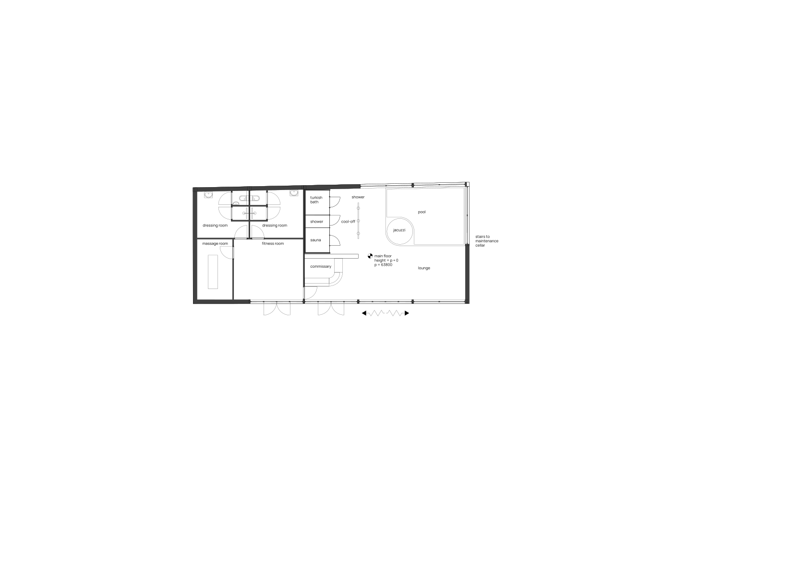

#+TITLE: Link Syntax Demo
#+PAGESIZE: A4
#+ORIENTATION: landscape
#+GRID: 12x8

* Demo Page

** PDF with Link Syntax
:PROPERTIES:
:TYPE: pdf
:AREA: A1,F4
:FIT: contain
:END:

This PDF element now supports Org-mode's standard link syntax!
The [[file:path]] link will be displayed inline in Emacs with org-display-inline-images.

** SVG with Link Syntax
:PROPERTIES:
:TYPE: svg
:AREA: G1,L4
:FIT: contain
:END:

[[file:assets/test-svgs/test-exploded-view-fixed-p11.svg]]

SVGs also support the link syntax for better Emacs integration.

** Image with Link Syntax (already supported)
:PROPERTIES:
:TYPE: figure
:AREA: A5,F8
:FIT: contain
:END:

Figures already supported this syntax, and it continues to work.

** Priority Order Example
:PROPERTIES:
:TYPE: pdf
:SRC: assets/test-svgs/test-plan-p11.svg
:AREA: G5,L8
:END:

[[file:assets/test-svgs/test-exploded-view-fixed-p11.svg]]

When both :SRC: and [[file:]] are present, :SRC: takes precedence.
This allows per-output overrides while maintaining Emacs preview capability.
