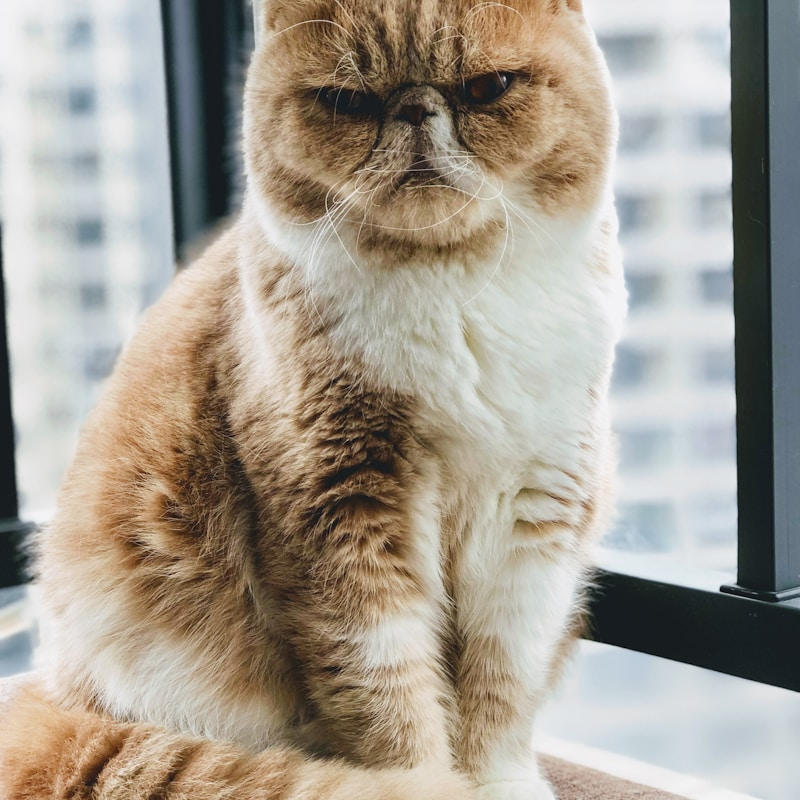
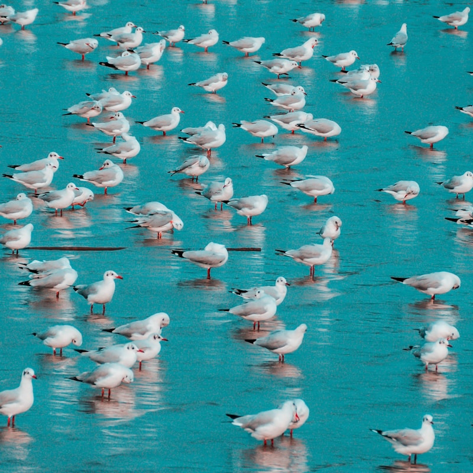

#+TITLE: PDF auto-contain scaling examples (cover deprecated; upscaling allowed)
#+AUTHOR: Example
#+PAGESIZE: A2
#+ORIENTATION: landscape
#+GRID: 10x10
#+MARGINS: 0
#+THEME: light
#+GRID_DEBUG: true
#+STYLE_ROUNDED_ORANGE: radius: 20pt, color: #00ff00, stroke: 5pt, stroke_color: #008000
#+STYLE_WEIGHT-100: font: Inter, size: 20pt, weight: 100
#+STYLE_WEIGHT-200: font: Inter, size: 20pt, weight: 200
#+STYLE_WEIGHT-300: font: Inter, size: 20pt, weight: 300
#+STYLE_WEIGHT-400: font: Inter, size: 20pt, weight: 400
#+STYLE_WEIGHT-500: font: Inter, size: 20pt, weight: 500
#+STYLE_WEIGHT-600: font: Inter, size: 20pt, weight: 600
#+STYLE_WEIGHT-700: font: Inter, size: 20pt, weight: 700
#+STYLE_WEIGHT-800: font: Inter, size: 20pt, weight: 800
#+STYLE_SUBHEADER: font: Inter, size:32pt, weight:700

* font weights
:PROPERTIES:
:GRID: 8x20
:END:

** header
:PROPERTIES:
:type: subheader
:AREA: A2, A7
:valign: bottom
:padding: 0,0,5,0
:END:
Text properties
** Text properTies
:PROPERTIES:
:AREA: b2,b7
:TYPE: body
:STYLE: weight-600
:JUSTIFY: true
:PADDING: 0, 15,0,0
:END:
*/Using variable weight fonts:/*

** 100
:PROPERTIES:
:AREA: c2,c7
:TYPE: body
:STYLE: weight-100
:JUSTIFY: true
:PADDING: 0, 15,0,0
:END:
A Gnat alighted on one of the horns of a Bull, and remained sitting there for a considerable time.

** 200
:PROPERTIES:
:AREA: d2,d7
:TYPE: body
:STYLE: weight-200
:JUSTIFY: true
:PADDING: 0, 15,0,0
:END:
A Gnat alighted on one of the horns of a Bull, and remained sitting there for a considerable time.

** 300
:PROPERTIES:
:AREA: e2,e7
:TYPE: body
:STYLE: weight-300
:JUSTIFY: true
:PADDING: 0, 15,0,0
:END:
A Gnat alighted on one of the horns of a Bull, and remained sitting there for a considerable time.

** 400
:PROPERTIES:
:AREA: f2,f7
:TYPE: body
:STYLE: weight-400
:JUSTIFY: true
:PADDING: 0, 15,0,0
:END:
A Gnat alighted on one of the horns of a Bull, and remained sitting there for a considerable time.

** 500
:PROPERTIES:
:AREA: g2,g7
:TYPE: body
:STYLE: weight-500
:JUSTIFY: true
:PADDING: 0, 15,0,0
:END:
A Gnat alighted on one of the horns of a Bull, and remained sitting there for a considerable time.

** 600
:PROPERTIES:
:AREA: h2,h7
:TYPE: body
:STYLE: weight-600
:JUSTIFY: true
:PADDING: 0, 15,0,0
:END:
A Gnat alighted on one of the horns of a Bull, and remained sitting there for a considerable time.

** 700
:PROPERTIES:
:AREA: i2,i7
:TYPE: body
:STYLE: weight-700
:JUSTIFY: true
:PADDING: 0, 15,0,0
:END:
A Gnat alighted on one of the horns of a Bull, and remained sitting there for a considerable time.

** 800
:PROPERTIES:
:AREA: j2,j7
:TYPE: body
:STYLE: weight-800
:JUSTIFY: true
:PADDING: 0, 15,0,0
:END:
A Gnat alighted on one of the horns of a Bull, and remained sitting there for a considerable time.

** 800
:PROPERTIES:
:AREA: k2,k7
:TYPE: body
:STYLE: weight-800
:JUSTIFY: true
:PADDING: 0, 15,0,0
:END:
A Gnat alighted on one of the horns of a Bull, and remained sitting there for a considerable time.

** emphasis
:PROPERTIES:
:AREA: l2,l7
:TYPE: body
:STYLE: weight-400
:JUSTIFY: true
:PADDING: 0, 15,0,0
:END:
*Using Emphasis*

A Gnat *alighted* on one of the /horns/ of a */Bull/*, and remained sitting there for a considerable time.

** table
:PROPERTIES:
:AREA: n2,p7
:TYPE: body
:STYLE: weight-400
:JUSTIFY: true
:PADDING: 0, 15,0,0
:END:
*Using Orgmode tables*

| /Player/       | /CPM%/ | PASSING YARDS | RUSHING YARDS |
|----------------+------+---------------+---------------|
| Joe Burrow     | 69.8 |          4641 |           202 |
| Lamar Jackson  | 67.9 |          3955 |           852 |
| Josh Allen     | 63.6 |          3731 |           531 |
| Jayden Daniels | 69.4 |          3530 |           864 |

* Image

** header
:PROPERTIES:
:type: subheader
:AREA: A2, A7
:valign: bottom
:padding: 0,0,5,0
:END:
Image fitting and alignment
** Square-ish Kitten (contain)
:PROPERTIES:
:TYPE: figure
:SRC: assets/test-images/kittens/kitten-2.jpg
 :AREA: b2,d5
:FIT: contain
:align: left
:CAPTION: kitten - contain align left
:END:
** Square-ish Kitten (contain)
:PROPERTIES:
:TYPE: figure
 :AREA: b6,d9
:FIT: contain
:align: right
:CAPTION: kitten - contain align right
:END:

** Square-ish Kitten cover
:PROPERTIES:
:TYPE: figure
:SRC: assets/test-images/kittens/kitten-2.jpg
:AREA: f2,h4
:FIT: cover
:align: left
:CAPTION: kitten - cover align left
:END:
** Square-ish Kitten (contain)
:PROPERTIES:
:TYPE: figure
:AREA: f7,h9
:FIT: cover
:align: right
:CAPTION: kitten - cover align right
:END:

* Image Fit Comparison
:PROPERTIES:
:ID: fit-test
:END:

** header
:PROPERTIES:
:type: subheader
:AREA: A2, A7
:valign: bottom
:padding: 0,0,5,0
:END:
Image fit comparison

** Contain - Default
:PROPERTIES:
:TYPE: figure
 :AREA: B1,D3
:FIT: contain
:CAPTION: fit: contain (default)
:Z: 20
:END:

** Cover - Fill Area (crops)
:PROPERTIES:
:TYPE: figure
 :AREA: B4,D6
:FIT: cover
:CAPTION: fit: cover (crops to fill)
:Z: 20
:END:

** Fill - Stretch proportionally to fill
:PROPERTIES:
:TYPE: figure
 :AREA: B7,D9
:FIT: fill
:CAPTION: fit: fill (may crop or scale)
:Z: 20
:END:

** Stretch - Distort (no caption)
:PROPERTIES:
:TYPE: figure
 :AREA: B10,D12
:FIT: stretch
:Z: 20
:END:

** Different Image Ratios
:PROPERTIES:
:TYPE: subheader
 :AREA: E1,E12
:END:
Testing with different aspect ratios

** Square-ish Kitten (contain)
:PROPERTIES:
:TYPE: figure
 :AREA: F1,G3
:FIT: contain
:CAPTION: kitten - contain
:align: left
:valign: bottom
:END:

** Square-ish Kitten (cover)  
:PROPERTIES:
:TYPE: figure
 :AREA: F4,G6
:FIT: cover
:CAPTION: kitten - cover
:END:

** Wide Ocean (contain)
:PROPERTIES:
:TYPE: figure
 :AREA: F7,G9
:FIT: contain  
:CAPTION: ocean - contain
:END:

** Wide Ocean (cover)
:PROPERTIES:
:TYPE: figure
 :AREA: F10,G12
:FIT: cover
:CAPTION: ocean - cover
:END:

* 1. Full page
** header
:PROPERTIES:
:type: subheader
:AREA: A2, A7
:valign: bottom
:padding: 0,0,5,0
:END:
Full page PDF
** Element
:PROPERTIES:
:TYPE: pdf
:PAGE: 1
:AREA: A1, J10
:PADDING: 0
:END:
[[file:assets/drawing_flat.pdf]]

* 1. pdf cover
** header
:PROPERTIES:
:type: subheader
:AREA: A2, A7
:valign: bottom
:padding: 0,0,5,0
:END:
PDF fit: cover
** Element
:PROPERTIES:
:TYPE: pdf
:PAGE: 1
:AREA: B2, d9
:PADDING: 0
:FIT: cover
:caption: Test caption with a pdf
:align: left
:END:
[[file:assets/drawing_flat.pdf]]

* 2. pdf placed with caption

** header
:PROPERTIES:
:type: subheader
:AREA: A2, A7
:valign: bottom
:padding: 0,0,5,0
:END:
placed PDF with caption
** Element
:PROPERTIES:
:TYPE: figure
:PAGE: 1
:AREA: B2, G7
:PADDING: 0
:Caption: A pdf with a caption
:END:
[[file:assets/drawing_flat.pdf]]
* 3. placed contained pdf with alignment left
** header
:PROPERTIES:
:type: subheader
:AREA: A2, A7
:valign: bottom
:FIT: contain
:padding: 0,0,5,0
:END:
placed contained pdf with alignment left
** Element
:PROPERTIES:
:TYPE: figure
:PAGE: 1
:AREA: b2,G10
:PADDING: 0
:FIT: contain
:align: left
:caption: caption
:END:
[[file:assets/drawing_flat.pdf]]

* placed contained pdf with alignment right
** header
:PROPERTIES:
:type: subheader
:AREA: A2, A7
:valign: bottom
:FIT: contain
:padding: 0,0,5,0
:END:
placed contained pdf with alignment right
** Element
:PROPERTIES:
:TYPE: figure
:PAGE: 1
:AREA: b2,G9
:PADDING: 0
:FIT: contain
:align: right
:caption: caption
:END:
[[file:assets/drawing_flat.pdf]]

* 4. Larger frame (may reach scale >= 1.0)

** header
:PROPERTIES:
:type: subheader
:AREA: A2, A7
:valign: bottom
:FIT: contain
:padding: 0,0,5,0
:END:
placed contained pdf with vertical alignment bottom

** Element
:PROPERTIES:
:TYPE: pdf
:PAGE: 1
:AREA: b5, i6 
:PADDING: 0
:ALIGN: right
:VALIGN: bottom
:caption: caption
:END:
[[file:assets/drawing_flat.pdf]]

* problematic pdf import

** header
:PROPERTIES:
:type: subheader
:AREA: A2, A9
:valign: bottom
:FIT: contain
:padding: 0,0,5,0
:END:
problematic pdf insert

** Element
:PROPERTIES:
:TYPE: pdf
:PAGE: 1
:AREA: b2, i9
:FIT: contain
:PADDING: 0
:ALIGN: right
:VALIGN: bottom
:caption: muchpdf choked on this pdf
:END:
[[file:assets/test-pdfs/test-exploded-view.pdf]]

* Rectangle style override demo

** header
:PROPERTIES:
:type: subheader
:AREA: A2, A7
:valign: bottom
:FIT: contain
:padding: 0,0,5,0
:END:
rectangle style and override

** Element
:PROPERTIES:
:TYPE: rectangle
:STYLE: rounded_orange
:COLOR: #ff0000
:RADIUS: 50%
:PADDING: 10
:AREA: B2,e5
:END:
Demonstrates rectangle with style plus overrides (:COLOR:, :RADIUS:) and proper :PADDING: capitalization.

** Element
:PROPERTIES:
:TYPE: rectangle
:STYLE: rounded_orange
:COLOR: #ff0000
:RADIUS: 50%
:PADDING: 0
:AREA: B6,e9
:END:
Demonstrates rectangle with style plus overrides (:COLOR:, :RADIUS:) and proper :PADDING: capitalization.

